<p align="center">
  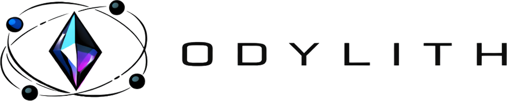
</p>

<h2 align="center" style="font-size: 2.4rem;">Odylith Stops Coding Agents From Confidently Doing The Wrong Thing</h2>
<p align="center" style="font-size: 1.35rem;"><strong>It makes coding agents operate like disciplined engineers instead of clever tourists.</strong></p>

> [!IMPORTANT]
> Odylith is not a standalone app or IDE. Install it into a repo, then use it
> through an AI coding agent such as Codex or Claude Code. In Odylith, the
> agent is the execution interface and `odylith/index.html` is the operating
> surface that keeps intent, constraints, topology, and execution state
> visible.
>
> Odylith supports both Codex and Claude Code as first-class agent hosts.
>
> Odylith is GA on its supported public install platforms as of `2026-04-07`.

## Quick Start

Install Odylith from the Git-backed repository you want to augment:

```bash
curl -fsSL https://odylith.ai/install.sh | bash
```

Run it from the repo root when you can; Odylith can also detect that root from
any subdirectory inside the same repo. The current GA platform contract covers
macOS (Apple Silicon) and Linux (`x86_64`, `ARM64`). Intel macOS and Windows
are not part of the current GA platform set.

After install, open the repo in Codex or Claude Code and say:

> **"Odylith, show me what you can do."**

Odylith reads your repo — source structure, import graph, manifest files — and
shows you exactly what governance records it can create: component boundaries,
workstreams, architecture diagrams, and issues. Each suggestion comes with the
command to create it.

That one instruction is all you need. From there, start working normally.
Odylith grounds every turn automatically — no special prompts, no commands to
memorize. See **[Operator Instructions](docs/OPERATOR_INSTRUCTIONS.md)** for
the full set of things the agent understands.

> [!TIP]
> **⭐ If Odylith makes your coding agent materially sharper in real repo work,
> star the repo so other operators can find it.**

## What Does The Name "Odylith" Mean?

Odylith combines "Ody," suggesting a journey, with "lith," from the Greek
_lithos_, meaning stone. The result is a name that suggests movement guided by
permanence: exploration anchored by a stable core. It reflects the idea at the
heart of the product: motion with a center, exploration with structure, and a
path toward agentic AI swarms that replace rigid monoliths with adaptive,
living networks.

## Intro

**Odylith changes the operating conditions for Codex or Claude Code.**

- It replaces blind repo search with scoped grounding.
- It gives the agent durable repo-local memory and a forensic trail.
- It governs validation, diagnosis, recovery, and closeout.

Base coding agents can read a repo, search files, sketch a plan, write code,
and infer some local context from the code itself. But serious work depends on
intent, constraints, ownership, validation obligations, and definition of done
that are not reliably encoded in code alone.

With Odylith, that execution truth becomes explicit and durable in the
repository, so the agent starts from governed context instead of
reconstructing it from scratch on every turn.

### Turn Requests Into Execution Truth

Odylith gives coding agents two durable advantages: **delivery intelligence**
and **delivery governance**.

Delivery intelligence recovers intent, constraints, dependencies, topology,
and validation requirements from the repository's real operating history.

Delivery governance turns that into execution truth: the right slice, the
right owner, the blockers, and the real definition of done.

That is the real value: less time re-deriving the repository, more time making
the right change.

More on the operating frame:
[Why Bolting Odylith Onto Codex Or Claude Code Changes The Outcome](docs/WHY_ODYLITH_CHANGES_OUTCOMES.md)

## Context Engine

The Context Engine answers one question: **"what is true and relevant?"** It
narrows the repo to the smallest grounded slice before the agent reasons,
plans, or asks the execution engine whether a move is admissible.

More on the Context Engine:
[Context Engine](docs/CONTEXT_ENGINE.md)

## Execution Engine

The execution engine answers one question: **"given what we know is true,
what is the next admissible move?"** It sits between the Context Engine and
the actual tool invocation layer, turning grounded context into a
machine-readable contract that governs what the agent can and cannot do next.

More on the execution engine:
[Execution Engine](docs/EXECUTION_ENGINE.md)

## Tribunal

One of Odylith's core strengths is that it can take one blocked or ambiguous repo posture, run ten specialist actors over the same grounded evidence, and force an adjudicated case before the agent acts. Tribunal is the engine for that step. It is not the first-turn grounding path. It runs in higher-level delivery-intelligence flows such as odylith sync, governed surface refresh, and evaluation or benchmark paths when Odylith needs to explain a live blocker, conflict, failure, or ambiguous posture in a workstream, component, or diagram.

<p align="center">
  
</p>

- It builds a grounded case file for the blocked scope.
- It runs specialist review and adjudicates one explicit read of the problem.
- It hands bounded remediation forward with validation and rollback guards.

More on Tribunal and the product control plane:
[Odylith Product Components](odylith/PRODUCT_COMPONENTS.md)

## Surface Tour

Captured from the local Odylith shell in this repository. The screenshots below
were refreshed on `2026-04-05`. Click any screengrab to open the full-size
image.

All of the views below are the canonical `odylith/index.html` shell with a
specific surface tab active, because that is the actual operator experience
Odylith ships.

### Radar

The example below shows workstream `B-040` inside the Radar shell.

<a href="docs/readme/surfaces/radar-shell.png">
  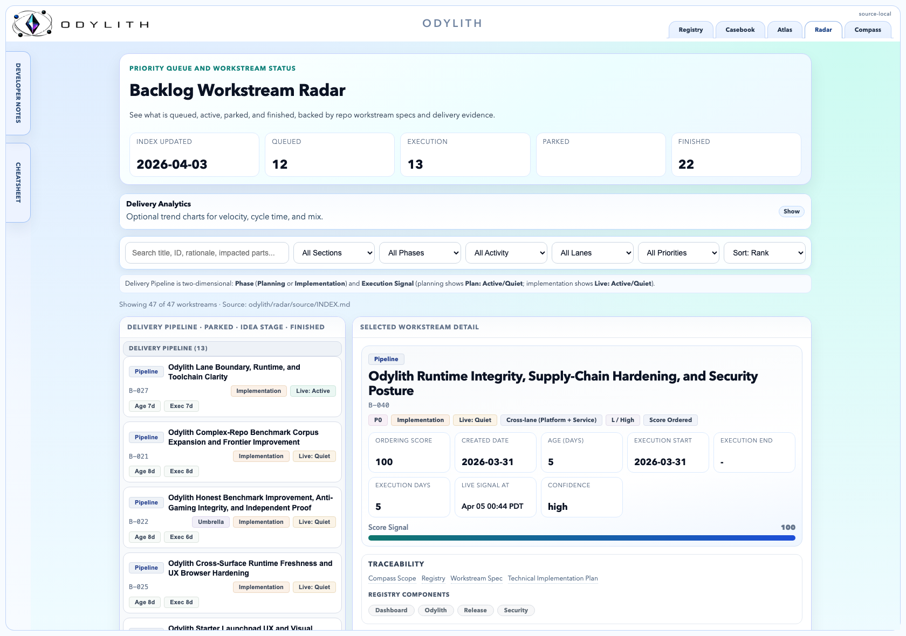
</a>

- **Ranked backlog:** the left rail is the active delivery queue, grouped by
  execution state so the agent sees what is moving, parked, or already done.
- **Selected workstream detail:** the right pane turns one workstream into
  execution truth with score, dates, confidence, traceability, and linked
  specs or plans.
- **Delivery controls:** the search and filter bar lets you narrow by section,
  phase, activity, lane, priority, and sort order without leaving the shell.

### Compass

The example below shows the live global Compass brief in the `48h` window.

<a href="docs/readme/surfaces/compass-shell.png">
  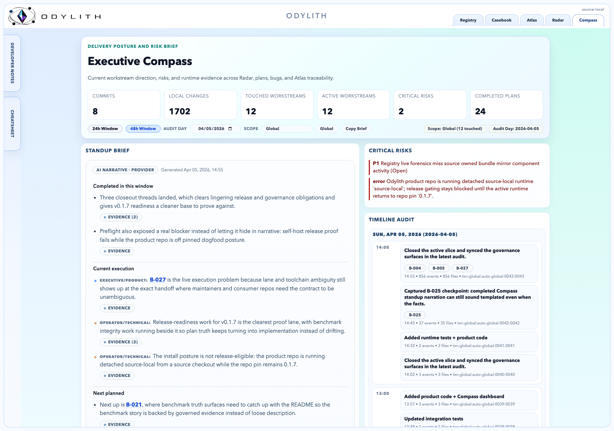
</a>

- **Standup brief:** the left column summarizes what changed, what matters
  now, and what the current execution slice is trying to achieve.
- **Audit timeline:** the right column is the timeline audit, showing
  timestamped execution evidence for the selected audit day.
- **Scope and time controls:** the top pills switch between `24h` and `48h`
  windows, set the audit day, and move between global and workstream-scoped
  views.

### Atlas

The example below shows diagram `D-017` inside the Atlas shell.

<a href="docs/readme/surfaces/atlas-shell.png">
  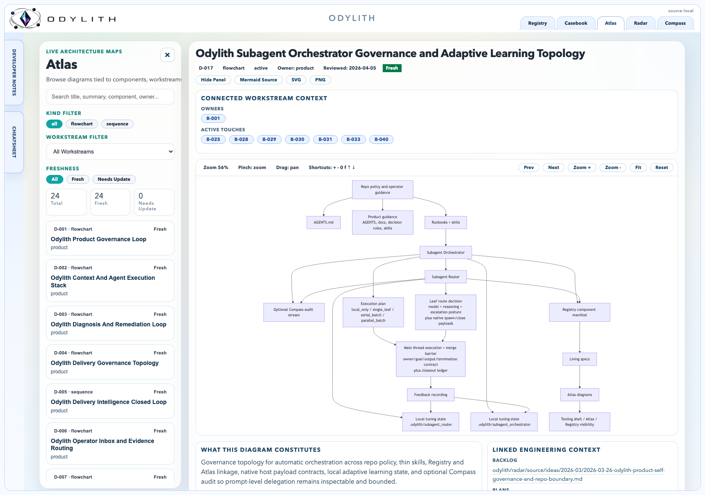
</a>

- **Diagram catalog:** the left rail is the searchable Atlas index, with
  filters for kind, workstream, and freshness.
- **Connected workstream context:** the header binds each diagram to owners,
  active touches, and historical references so topology stays grounded in live
  delivery.
- **Diagram viewer:** the center pane is the zoomable diagram itself, with
  controls to pan, fit, export, and inspect the architecture without leaving
  the shell.

### Registry

The example below shows the `Tribunal` component dossier inside the Registry shell.

<a href="docs/readme/surfaces/registry-shell.png">
  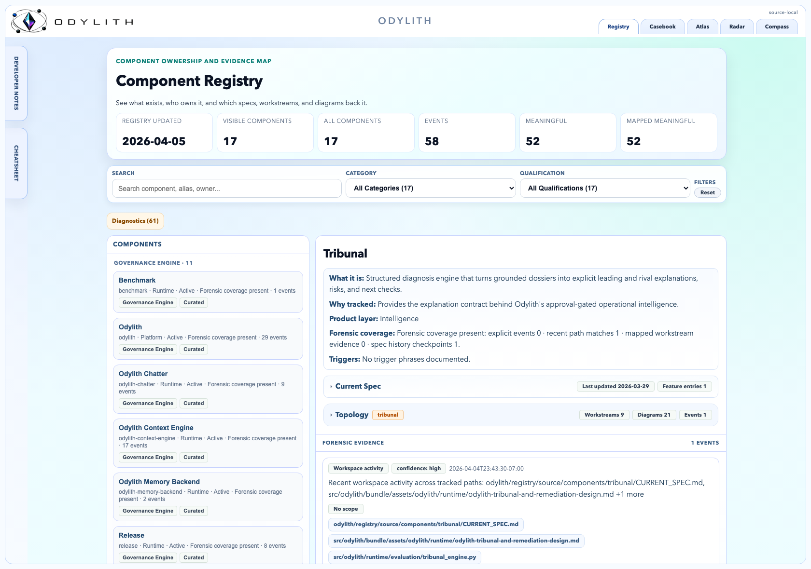
</a>

- **Component inventory:** the left column is the curated component list, which
  gives the agent a governed map of what exists.
- **Component dossier:** the main panel explains what a component is, why it is
  tracked, what spec or topology is attached, and which forensic evidence
  supports it.
- **Change chronology:** the lower forensic stream is the audit trail for that
  component, so history and evidence stay attached to the current spec.

### Casebook

The example below shows case `CB-009` inside the Casebook shell.

<a href="docs/readme/surfaces/casebook-shell.png">
  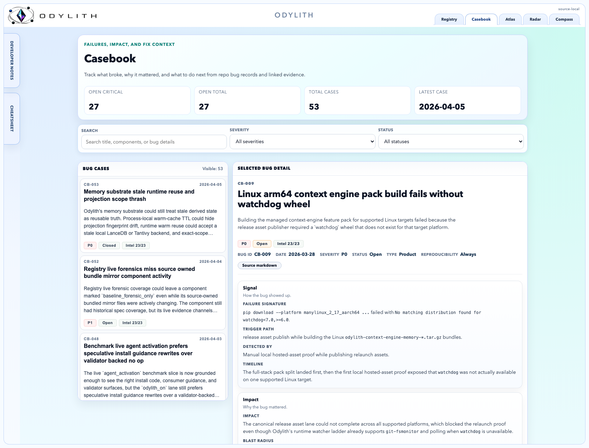
</a>

- **Bug case queue:** the left column is the searchable case list, with
  severity and status filters to separate active incidents from resolved
  learnings.
- **Selected bug detail:** the main pane turns one failure into a reusable
  dossier with description, failure signature, detection path, ownership, and
  fix history.
- **Prevention memory:** the lower sections keep the root cause, verification,
  rollback, and regression tests visible so the same bug is less likely to
  return.

## Benchmarks

Odylith publishes two benchmark views and keeps their claims separate:

- `Internal Diagnostic Benchmark` (`--profile diagnostic`): measures how well
  Odylith builds the right grounded context before the live agent run
- `Live Benchmark` (`--profile proof`): measures how well Odylith completes
  the real task end to end as a full-product assistance stack against the raw
  host CLI

In README framing, `odylith_off` is the raw host CLI lane.

Current public proof posture is local-first memory on LanceDB plus Tantivy.
These are first public eval runs and should be read as a baseline, not a
ceiling. Odylith supports both Codex and Claude Code, but the current
published live proof is still Codex-host-scoped; the benchmark contract itself
is host-neutral. Odylith wins by grounding and operationalizing shared repo
truth better, not by hiding truth from the baseline lane or by quietly using
undeclared benchmark affordances.

### Internal Diagnostic Benchmark

> [!NOTE]
> The Internal Diagnostic Benchmark (`--profile diagnostic`) is not the
> product claim. It isolates packet and prompt construction quality before any
> live host session begins.

The Internal Diagnostic Benchmark answers:

- "Does Odylith build a better grounded packet/prompt than `odylith_off`?"
- "What is the prep-time and prompt-size cost of Odylith’s retrieval/memory layer?"
- "Does Odylith improve required-path coverage before the model starts working?"

Diagnostic benchmark snapshot:
[Current Internal Diagnostic Benchmark Snapshot](docs/benchmarks/GROUNDING_BENCHMARK_SNAPSHOT.md)

Diagnostic benchmark tables:
[Benchmark Tables](docs/benchmarks/BENCHMARK_TABLES.md)

#### Diagnostic Graphs

Read the current diagnostic outcome in the linked snapshot and tables. The
graphs below should be interpreted together with the generated diagnostic
snapshot, not as standalone claims detached from the selected report.

<p align="center">
  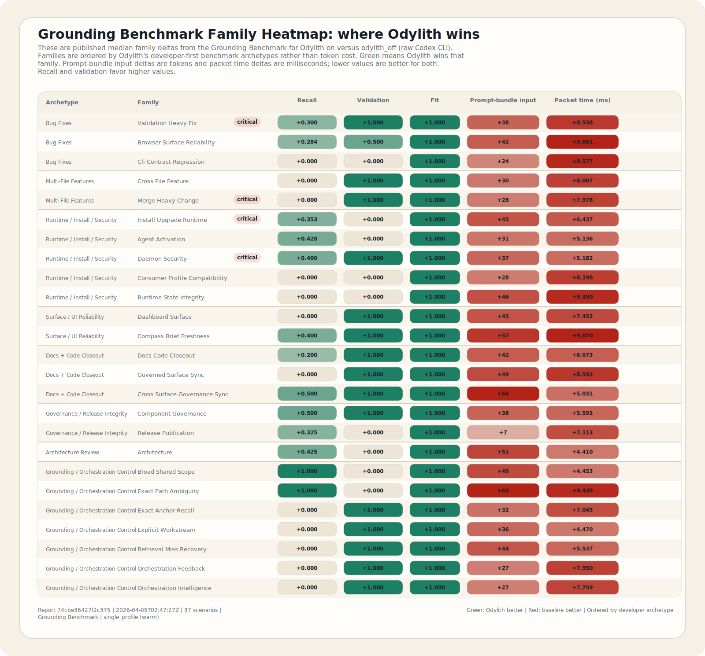
</p>
<p align="center">
  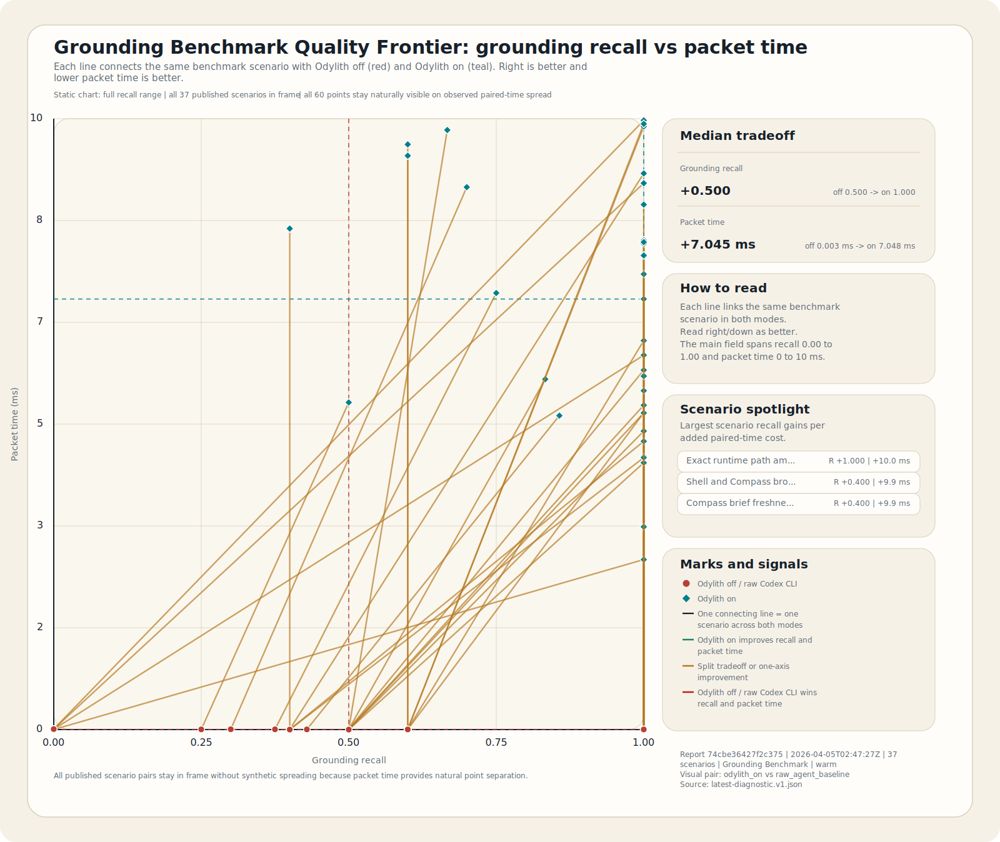
</p>
<p align="center">
  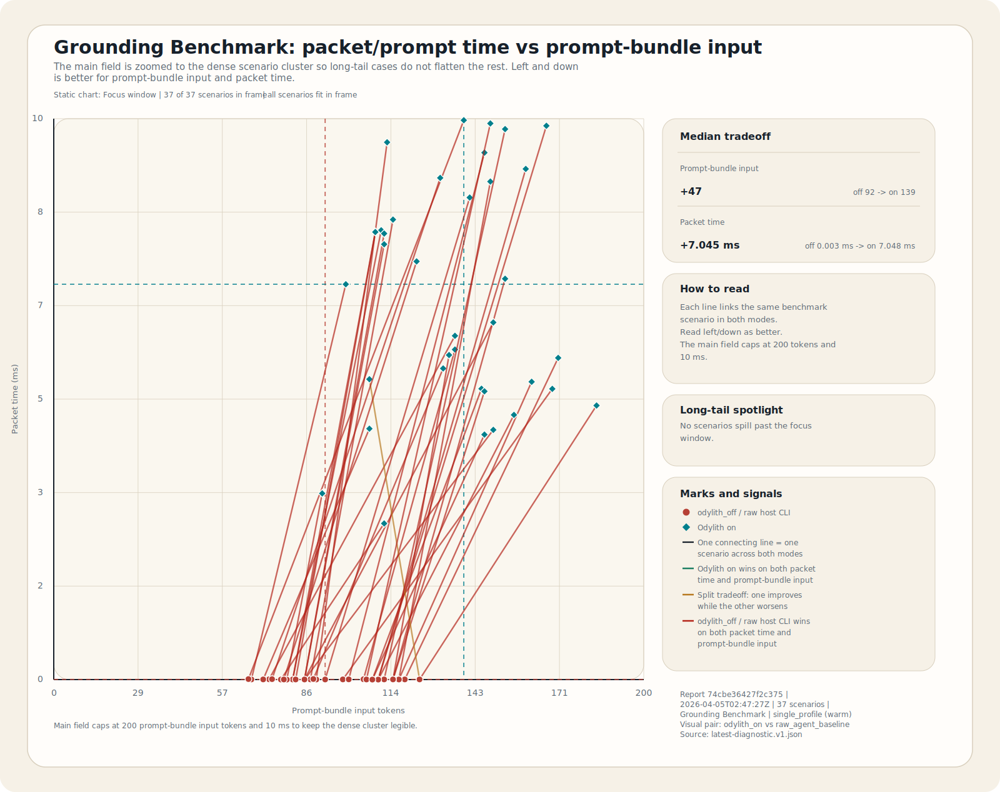
</p>
<p align="center">
  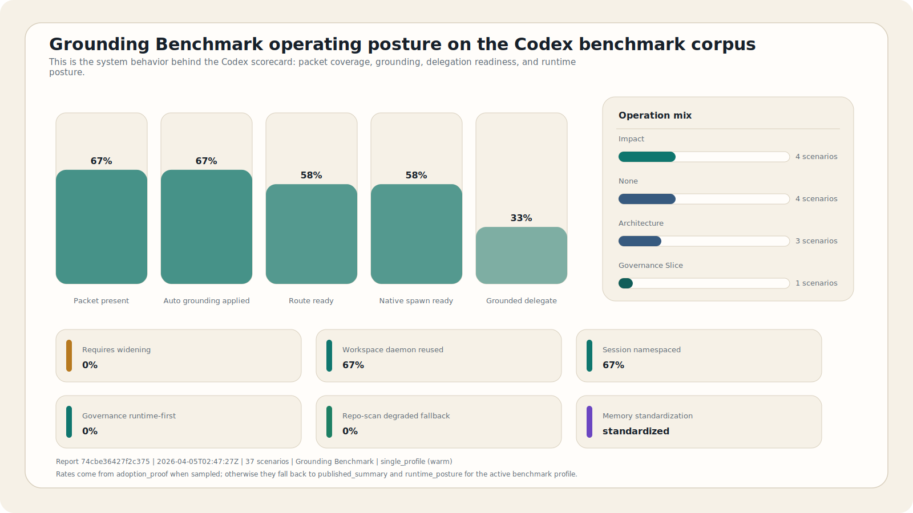
</p>

### Live Benchmark

> [!TIP]
> The Live Benchmark (`--profile proof`) is the product-claim lane. Read the
> current generated snapshot for the active proof status instead of relying on
> stale README prose.

The Live Benchmark answers:

- "Does Odylith beat the raw host CLI on the same live end-to-end task contract?"
- "What is the full matched-pair time to valid outcome?"
- "Does Odylith improve required-path coverage, validation, and expectation success on the live run?"

Live benchmark snapshot:
[Current Live Benchmark Snapshot](docs/benchmarks/LIVE_BENCHMARK_SNAPSHOT.md)

Live benchmark tables:
[Benchmark Tables](docs/benchmarks/BENCHMARK_TABLES.md)

#### Live Graphs

Read the current live-proof outcome in the linked snapshot and tables. The
graphs below should be read as report-backed views of the selected proof
artifact, not as a second hand-maintained benchmark claim in the README.

<p align="center">
  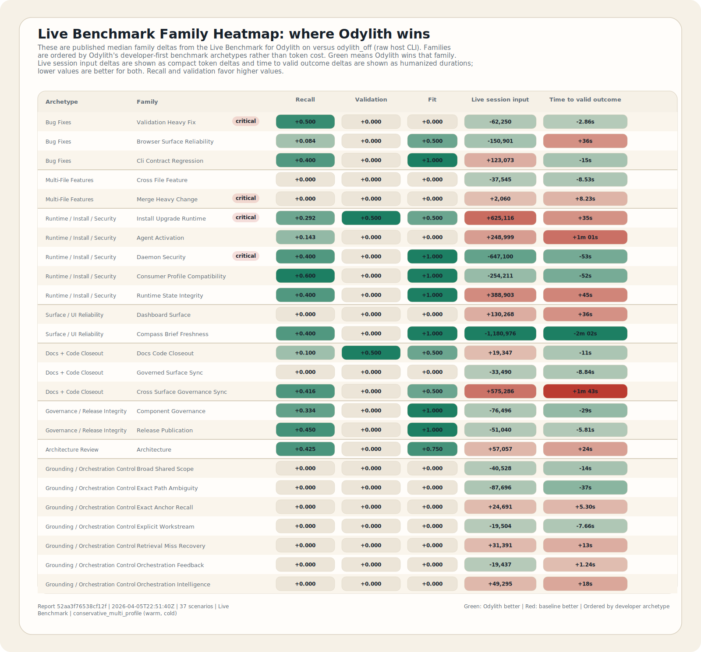
</p>
<p align="center">
  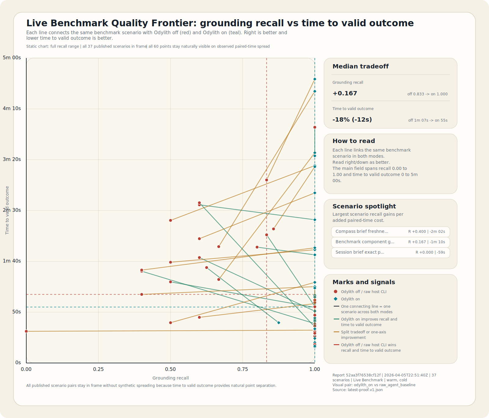
</p>
<p align="center">
  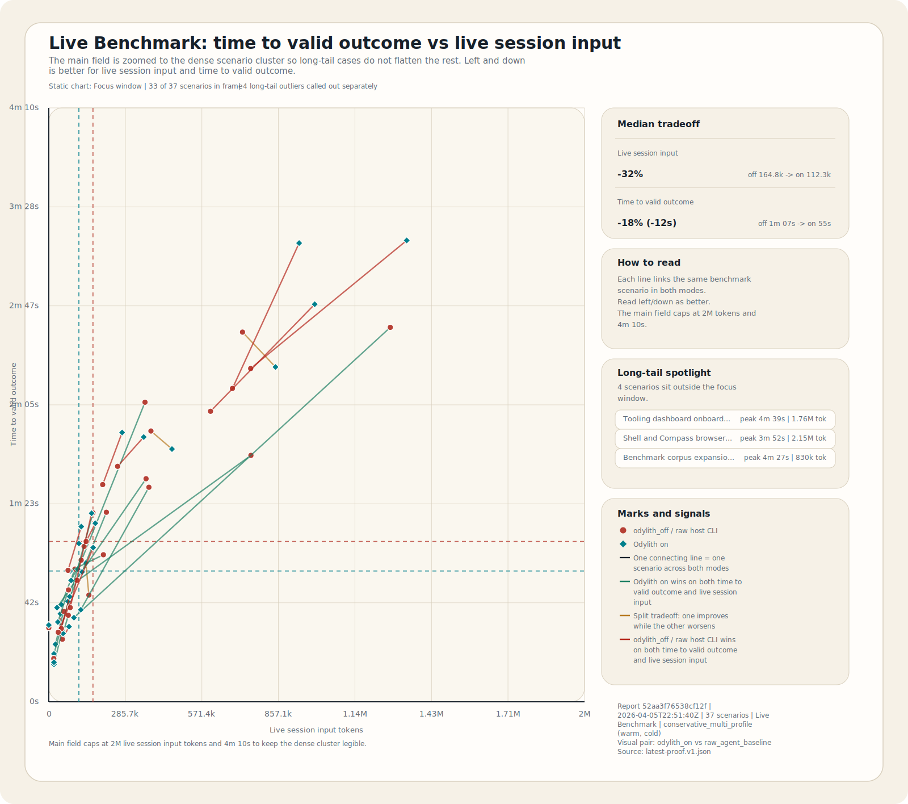
</p>
<p align="center">
  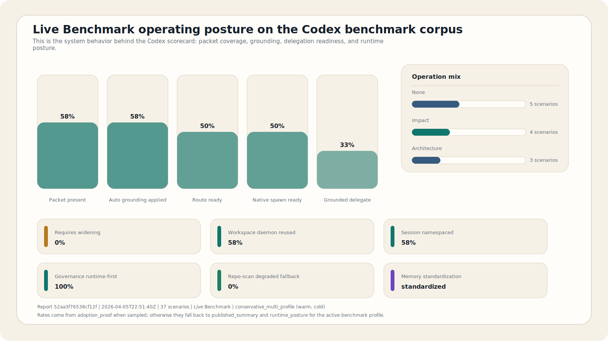
</p>

Need help reading the graphs, reports, and artifacts? See
[How To Read Odylith's Benchmark Proof](docs/benchmarks/README.md).

## Best Fit Use Cases

Odylith is strongest when:

- the work spans multiple files, contracts, or governance surfaces
- the repo is large enough that boundaries, ownership, bug history, and
  execution state matter
- you want specs, plans, component inventory, diagrams, and bug history to
  live beside the code instead of across separate SaaS tools
- you want recent execution and decisions visible in Compass instead of buried
  in terminal history

Odylith is not meant to replace direct file reads for tiny obvious edits. It is
most useful when the repo is large enough that repo memory, topology, workstream
state, and execution history start to matter.

## Odylith Governs Itself

This repo also uses Odylith on itself.

| Surface | Product-Owned Truth |
| --- | --- |
| Radar | `odylith/radar/` |
| Atlas | `odylith/atlas/` |
| Compass | `odylith/compass/` |
| Registry | `odylith/registry/` |
| Casebook | `odylith/casebook/` |

## Read Next

- [First Run In An Odylith Repo](odylith/README.md#first-run)
- [FAQ](odylith/FAQ.md)
- [Operating Model](odylith/OPERATING_MODEL.md)
- [Product Components](odylith/PRODUCT_COMPONENTS.md)
- [Advanced Operator Use Cases](docs/ADVANCED_OPERATOR_USE_CASES.md)
- [Governance Surfaces](odylith/surfaces/GOVERNANCE_SURFACES.md)
- [What Gets Installed](docs/specs/odylith-repo-integration-contract.md#what-gets-installed)
- [Repo Integration Contract](docs/specs/odylith-repo-integration-contract.md)
- [Install and Upgrade Runbook](odylith/INSTALL_AND_UPGRADE_RUNBOOK.md)
- [How To Read Odylith's Benchmark Proof](docs/benchmarks/README.md)
- [Project Status And Disclosures](docs/STATUS_AND_DISCLOSURES.md)
