<p align="center">
  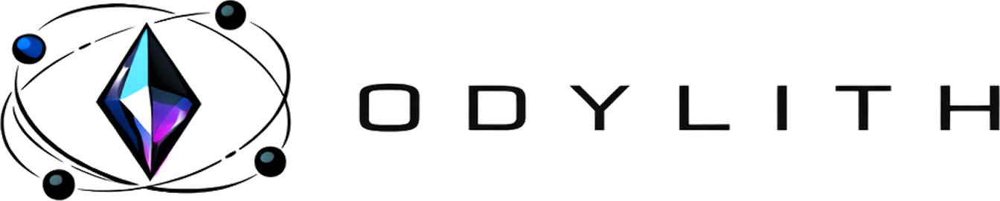
</p>

<h2 align="center" style="font-size: 2.4rem;">Odylith Stops Coding Agents From Confidently Doing The Wrong Thing</h2>
<p align="center" style="font-size: 1.35rem;"><strong>It makes coding agents operate like disciplined engineers instead of clever tourists.</strong></p>

## Intro

Install Odylith into a project folder on your laptop. Use it through Codex or Claude Code.

Without Odylith, every agent session starts from scratch. Reading the repo,
inferring the architecture, guessing intent and constraints, discovering what
went wrong last time. With Odylith, the agent starts from governed truth: the
right slice, the real component boundaries, the live blockers, the invariants,
the historical learnings from past failures, and the full execution history. It
gets to the actual work faster, makes fewer wrong moves, and leaves durable
evidence behind for the next session. The more you use Odylith, the better it
gets. Every workstream, every bug, every component boundary, every decision
teaches it more about your repo, so it grounds the next session deeper than the
last.

Odylith reasons about your repo through delivery intelligence, grounds every
turn through local-first retrieval, governs every action through execution
admissibility, adjudicates ambiguous postures through its Tribunal, and keeps
its own durable memory across sessions. It runs through both Codex and Claude
Code as first-class hosts.

More on the operating frame:
[Why Bolting Odylith Onto Codex Or Claude Code Changes The Outcome](docs/WHY_ODYLITH_CHANGES_OUTCOMES.md)

## Quick Start

Install Odylith in a project folder on your laptop:

```bash
curl -fsSL https://odylith.ai/install.sh | bash
```

Open a terminal in the project folder on your laptop, then run the command.
Odylith installs into that folder on your laptop. It does not install into
GitHub or any external service. The folder can be a Git repo, but it does not
have to be.
The current GA platform contract covers macOS (Apple Silicon) and Linux
(`x86_64`, `ARM64`). Intel macOS and Windows are not part of the current GA
platform set.

## Prove It In 2 Minutes

Open the repo in Codex or Claude Code and say:

> **"Odylith, show me what you can do."**

Odylith reads your repo — source structure, import graph, manifest files — and
shows you the component boundaries, workstreams, architecture diagrams, and
issues it can create. Each suggestion comes with the command to run it.

Then open `odylith/index.html` in a browser and follow the Cheatsheet in the
drawer.

See **[Operator Instructions](docs/OPERATOR_INSTRUCTIONS.md)** for the full
set of things you can ask the agent to do.

> [!TIP]
> **⭐ If Odylith makes your coding agent materially sharper in real repo work,
> star the repo so other operators can find it.**

## What Does The Name "Odylith" Mean?

Odylith combines "Ody," suggesting a journey, with "lith," from the Greek
_lithos_, meaning stone. The result is a name that suggests movement guided by
permanence: exploration anchored by a stable core. It reflects the idea at the
heart of the product: motion with a center, exploration with structure, and a
path toward agentic AI swarms that replace rigid monoliths with adaptive,
living networks.

## Context Engine

The Context Engine answers one question: **"what is true and relevant?"** It
narrows the repo to the smallest grounded slice before the agent reasons,
plans, or asks the execution engine whether a move is admissible.

More on the Context Engine:
[Context Engine](docs/CONTEXT_ENGINE.md)

## Execution Engine

The execution engine answers one question: **"given what we know is true,
what is the next admissible move?"** It sits between the Context Engine and
the actual tool invocation layer, turning grounded context into a
machine-readable contract that governs what the agent can and cannot do next.

More on the execution engine:
[Execution Engine](docs/EXECUTION_ENGINE.md)

## Tribunal

Tribunal is Odylith's structured diagnosis engine. It is what Odylith uses when
the repo is no longer a cold-start mystery, but the current posture is still
blocked, ambiguous, disputed, or risky enough that a normal "just continue"
agent move would be a bad bet. The Context Engine answers what is true and
relevant. The Execution Engine answers what move is admissible. Tribunal
answers a different question: **what is actually going on here, what rival
explanation could still be true, and what check would discriminate between
them?**

That is why Tribunal matters to the Odylith claim. It changes the failure mode
from "the model guessed and continued" into "the system opened a grounded case
before action." Same model, better operating frame: explicit evidence, rival
diagnosis, risk if wrong, discriminating next check, and bounded remediation.

Tribunal does not run on every turn and it is not the first-turn grounding
path. It runs inside higher-level delivery-intelligence flows such as
`odylith sync`, governed surface refresh, and evaluation or benchmark paths
when Odylith needs to explain a live blocker, conflict, failure, or ambiguous
posture in a workstream, component, or diagram.

<p align="center">
  
</p>

The pipeline is deliberately closer to an engineering review board than a
generic summarizer:

1. Delivery intelligence identifies live actionable scopes and filters out
   clear-path work.
2. Tribunal ranks candidates by scope type, scenario, severity, decision debt,
   governance lag, blast radius, and stable identity tie-breaks.
3. It builds a dossier for each focused case: subject, decision at stake,
   observations, evidence quality, proof refs, explanation facts, and compact
   evidence items.
4. Ten fixed actors review the same dossier: observer, ownership resolver,
   causal analyst, policy judge, normative judge, adversary, counterfactual
   analyst, gap analyst, risk analyst, and prescriber.
5. The adjudicator synthesizes one case form with a leading explanation,
   strongest rival, risk if wrong, discriminating next check, confidence,
   actor influence, and maintainer brief.
6. Optional provider enrichment can refine only named fields, and only when the
   result cites grounded evidence. Deterministic reasoning remains the baseline
   and provider failure degrades explicitly.
7. Remediator turns the adjudicated prescription into one bounded correction
   packet with validation, rollback, and stale guards.
8. The case queue, systemic brief, and correction packet feed the shell,
   Compass, Registry, benchmarks, and downstream intervention surfaces.

More on the Tribunal claim, pipeline, and product control plane:
[Tribunal and Remediation](odylith/runtime/TRIBUNAL_AND_REMEDIATION.md),
[Tribunal Component Spec](odylith/registry/source/components/tribunal/CURRENT_SPEC.md),
and [Odylith Product Components](odylith/PRODUCT_COMPONENTS.md)

## Surface Tour

Captured from the local Odylith shell in this repository. The screenshots below
were refreshed on `2026-04-05`. Click any screengrab to open the full-size
image.

All of the views below are the canonical `odylith/index.html` shell with a
specific surface tab active, because that is the actual operator experience
Odylith ships.

### Radar

The example below shows workstream `B-040` inside the Radar shell.

<a href="docs/readme/surfaces/radar-shell.png">
  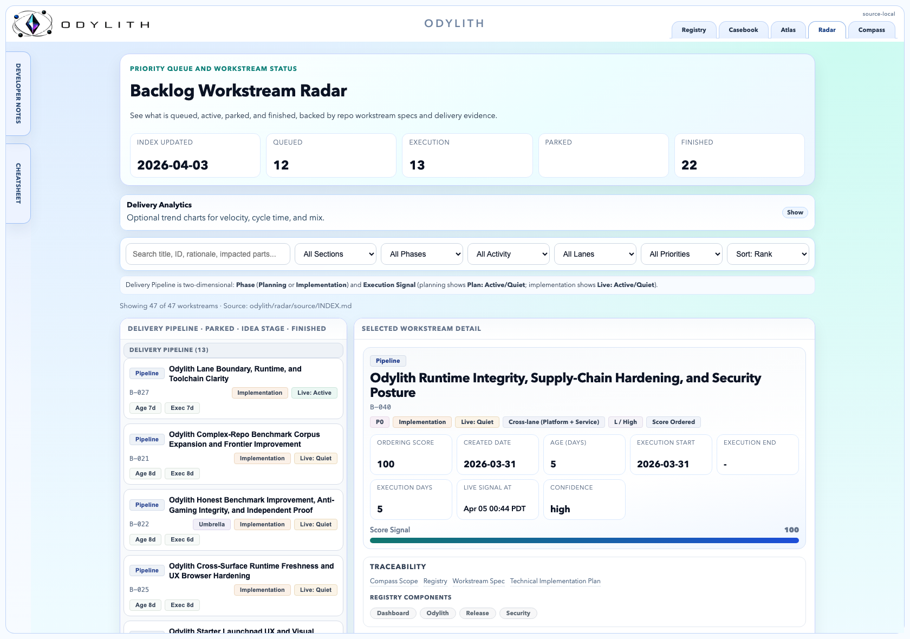
</a>

- **Ranked backlog:** the left rail is the active delivery queue, grouped by
  execution state so the agent sees what is moving, parked, or already done.
- **Selected workstream detail:** the right pane turns one workstream into
  execution truth with score, dates, confidence, traceability, and linked
  specs or plans.
- **Delivery controls:** the search and filter bar lets you narrow by section,
  phase, activity, lane, priority, and sort order without leaving the shell.

### Compass

The example below shows the live global Compass brief in the `48h` window.

<a href="docs/readme/surfaces/compass-shell.png">
  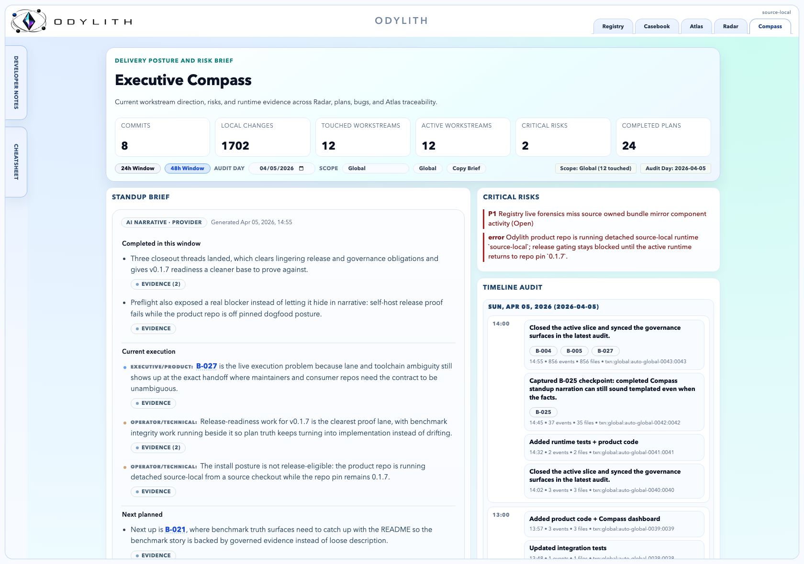
</a>

- **Standup brief:** the left column summarizes what changed, what matters
  now, and what the current execution slice is trying to achieve.
- **Audit timeline:** the right column is the timeline audit, showing
  timestamped execution evidence for the selected audit day.
- **Scope and time controls:** the top pills switch between `24h` and `48h`
  windows, set the audit day, and move between global and workstream-scoped
  views.

### Atlas

The example below shows diagram `D-017` inside the Atlas shell.

<a href="docs/readme/surfaces/atlas-shell.png">
  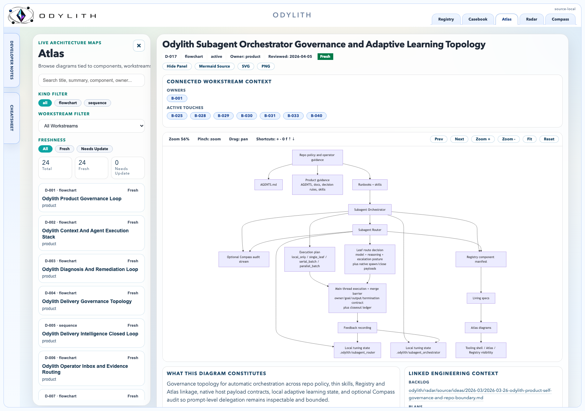
</a>

- **Diagram catalog:** the left rail is the searchable Atlas index, with
  filters for kind, workstream, and freshness.
- **Connected workstream context:** the header binds each diagram to owners,
  active touches, and historical references so topology stays grounded in live
  delivery.
- **Diagram viewer:** the center pane is the zoomable diagram itself, with
  controls to pan, fit, export, and inspect the architecture without leaving
  the shell.

### Registry

The example below shows the `Tribunal` component dossier inside the Registry shell.

<a href="docs/readme/surfaces/registry-shell.png">
  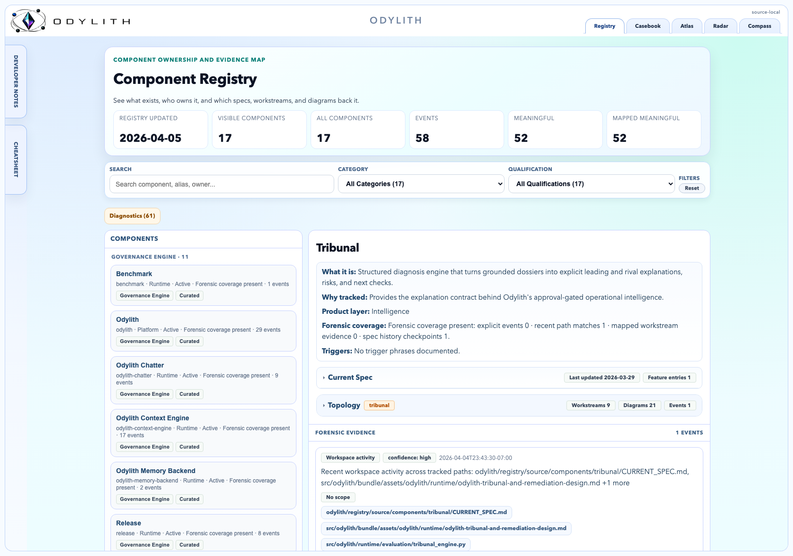
</a>

- **Component inventory:** the left column is the curated component list, which
  gives the agent a governed map of what exists.
- **Component dossier:** the main panel explains what a component is, why it is
  tracked, what spec or topology is attached, and which forensic evidence
  supports it.
- **Change chronology:** the lower forensic stream is the audit trail for that
  component, so history and evidence stay attached to the current spec.

### Casebook

The example below shows case `CB-009` inside the Casebook shell.

<a href="docs/readme/surfaces/casebook-shell.png">
  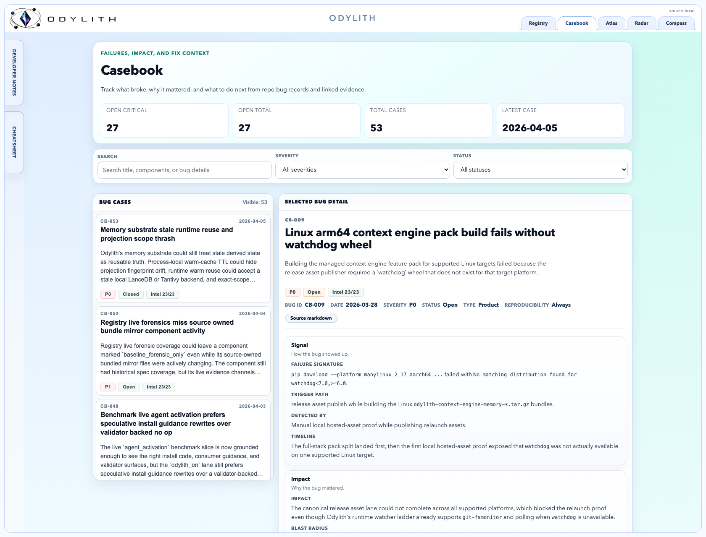
</a>

- **Bug case queue:** the left column is the searchable case list, with
  severity and status filters to separate active incidents from resolved
  learnings.
- **Selected bug detail:** the main pane turns one failure into a reusable
  dossier with description, failure signature, detection path, ownership, and
  fix history.
- **Prevention memory:** the lower sections keep the root cause, verification,
  rollback, and regression tests visible so the same bug is less likely to
  return.

## Benchmarks

In chess, the first move does not decide the entire game. But it shapes the
position. It defines the risk. It opens some lines and quietly closes others.
Working with coding agents feels the same: the opening matters.

**Odylith treats grounding as that opening move. In the v0.1.11 Grounding
Benchmark, Odylith spends a median `+834` prompt-bundle input tokens and
`+23 ms` packet time before the live agent run. That upfront cost is measured
against substantially better grounding signals: required-path recall `+0.326`,
validation-success proxy `+0.689`, and expectation-success proxy `+0.951`.
In the matching Live Benchmark, that produces significant downstream savings:
median total model tokens `-209,404` and median time to valid outcome
`-1m 28s`, while live required-path recall, validation success, and expectation
success also improve.**

### v0.1.11 Current Benchmark Report

Odylith publishes two benchmark views and keeps their claims separate:

- `Grounding Benchmark`: measures how well Odylith builds the right grounded
  context before the live agent run
- `Live Benchmark`: measures how well Odylith completes the real task end to
  end against Codex or Claude Code running without Odylith

In README framing, `odylith_off` means Codex or Claude Code running without
Odylith.

Current v0.1.11 public proof posture is local-first on the Odylith Memory
Substrate. These are first public eval runs and should be read as a baseline,
not a ceiling. The current full live proof was executed on Codex, while bounded
Codex and Claude smokes provide host-agnostic coverage and the benchmark
contract remains host-neutral. Odylith wins by grounding and operationalizing
shared repo truth better, not by hiding truth from the baseline lane or quietly
using undeclared benchmark affordances.

### Grounding Benchmark

> [!NOTE]
> The Grounding Benchmark is not the product claim. It isolates packet and
> prompt construction quality before any live host session begins.

The Grounding Benchmark answers:

- "Does Odylith build a better grounded packet/prompt than `odylith_off`?"
- "What is the prep-time and prompt-size cost of Odylith's retrieval/memory layer?"
- "Does Odylith improve required-path coverage before the model starts working?"

Current grounding report:
[9dcae95d5bb62c75](docs/benchmarks/GROUNDING_BENCHMARK_SNAPSHOT.md),
generated `2026-04-25T11:20:25Z`, status `provisional_pass`.

| Signal | Current grounding delta versus `odylith_off` |
| --- | ---: |
| Required-path recall | `+0.326` |
| Required-path precision | `+0.049` |
| Validation-success proxy | `+0.689` |
| Critical required-path recall | `+0.278` |
| Critical validation-success proxy | `+0.613` |
| Expectation-success proxy | `+0.951` |
| Median prompt-bundle input tokens | `+834` |
| Median packet time | `+23 ms` |

#### Current Grounding Graphs

<p align="center">
  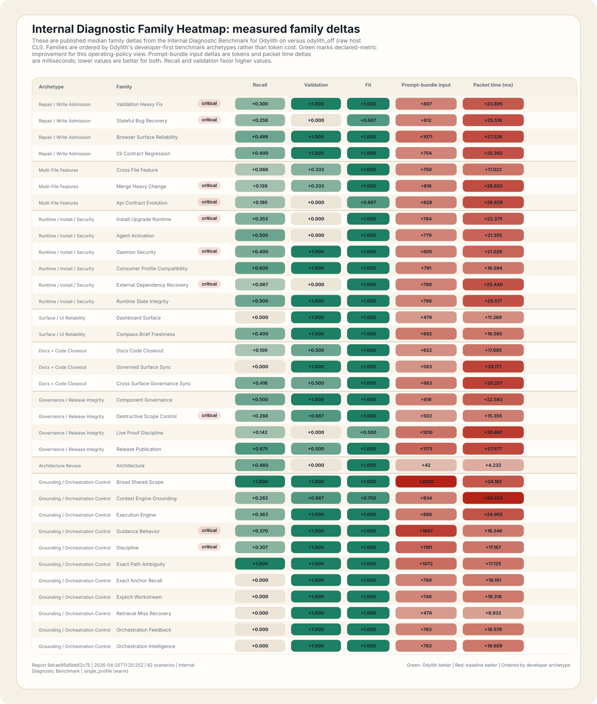
</p>
<p align="center">
  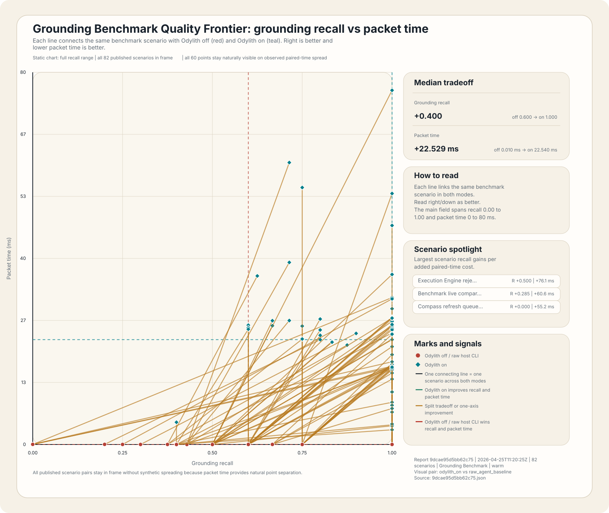
</p>
<p align="center">
  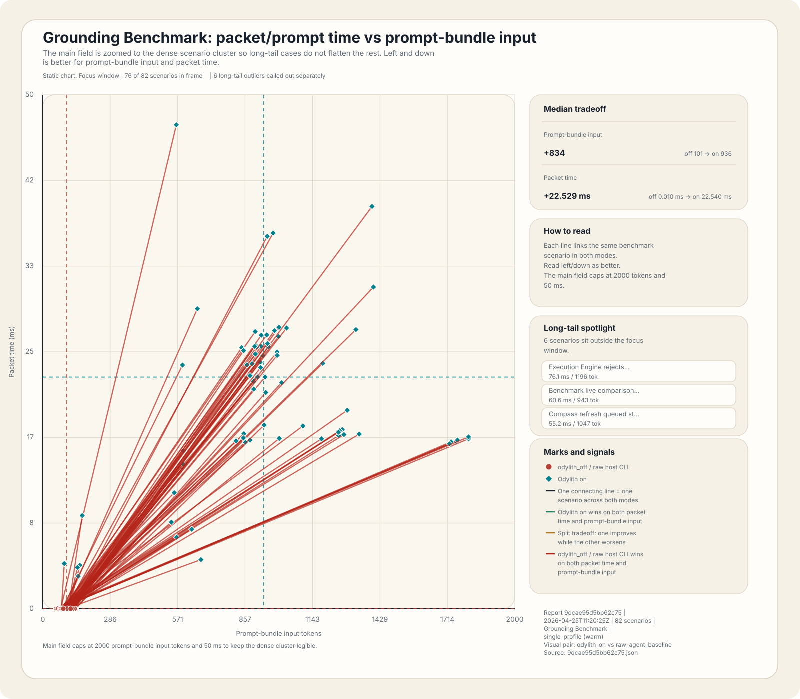
</p>
<p align="center">
  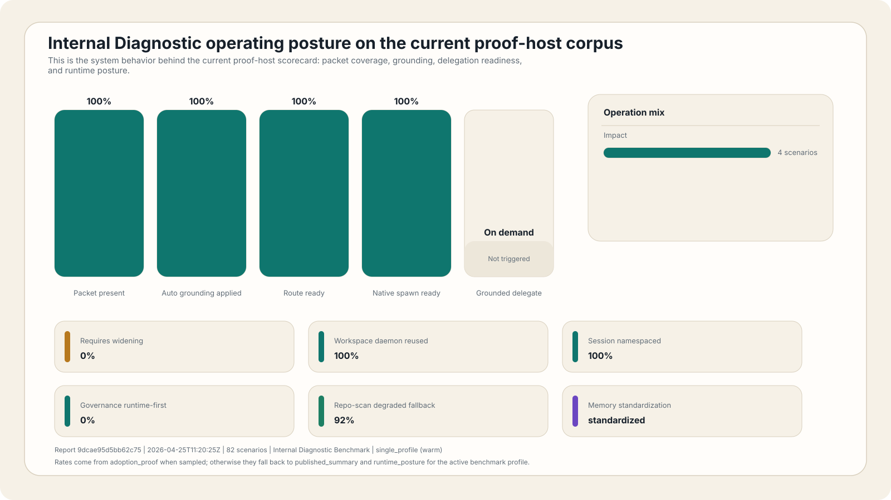
</p>

### Live Benchmark

> [!TIP]
> The Live Benchmark is the product-claim lane. It measures full end-to-end task
> completion after grounding, execution posture, focused checks, and validation
> policy are allowed to operate under the declared comparison contract.

The Live Benchmark answers:

- "Does Odylith beat Codex or Claude Code without Odylith on the same live
  end-to-end task contract?"
- "What is the full matched-pair time to valid outcome?"
- "Does Odylith improve required-path coverage, validation, and expectation success on the live run?"

Current live proof report:
[44f2a3d83d2c9975](docs/benchmarks/LIVE_BENCHMARK_SNAPSHOT.md),
generated `2026-04-25T11:19:38Z`, status `provisional_pass`.

| Signal | Current live proof delta versus `odylith_off` |
| --- | ---: |
| Required-path recall | `+0.258` |
| Required-path precision | `+0.421` |
| Hallucinated-surface rate | `-0.397` |
| Validation success | `+0.081` |
| Critical required-path recall | `+0.206` |
| Critical validation success | `+0.097` |
| Expectation success | `+0.688` |
| Write-surface precision | `+0.011` |
| Unnecessary widening | `-0.011` |
| Median live-session input tokens | `-206,626` |
| Median total model tokens | `-209,404` |
| Median time to valid outcome | `-1m 28s` |

Publication status:

- hard-gate blockers: none
- fairness contract passed: `True`
- corpus seriousness floor passed: `True`
- tracked-corpus coverage: `82 / 82` scenarios
- full matched pairs: `164` across `warm` and `cold`
- conservative published comparison: `82` same-scenario pairs
- warm/cold robustness consistency: `True`

Read the timing and token wins as benchmark wall-clock and full-session spend,
not solo-user interactive latency. Scenario-declared focused checks and no-op
proxy evidence are part of the declared benchmark contract and remain visible
in the machine-readable reports.

Full current artifacts:
[Live Snapshot](docs/benchmarks/LIVE_BENCHMARK_SNAPSHOT.md),
[Grounding Benchmark Snapshot](docs/benchmarks/GROUNDING_BENCHMARK_SNAPSHOT.md),
[Benchmark Tables](docs/benchmarks/BENCHMARK_TABLES.md), and
[How To Read Odylith's Benchmark Proof](docs/benchmarks/README.md).
The versioned GitHub artifact bundle, including the compressed raw source
truth, is stored under
[docs/benchmarks/v0.1.11](docs/benchmarks/v0.1.11/README.md).

#### Current Live Graphs

<p align="center">
  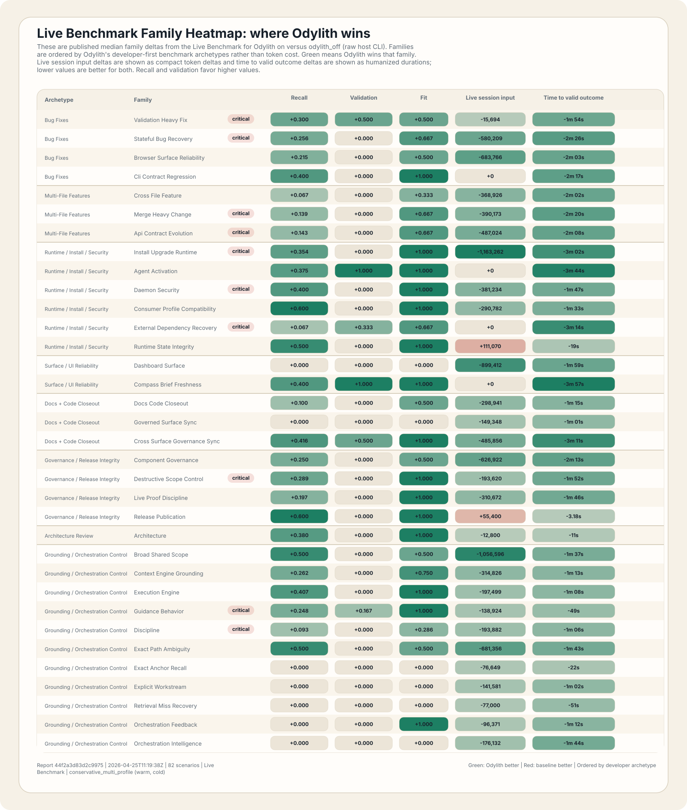
</p>
<p align="center">
  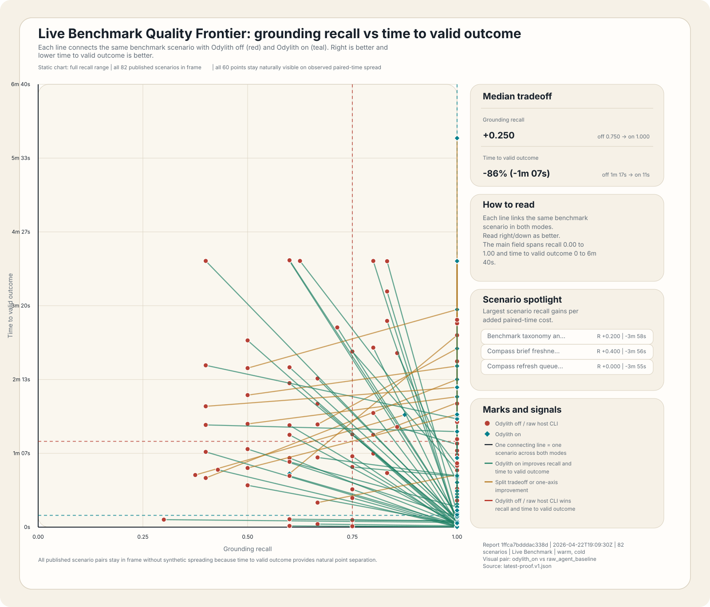
</p>
<p align="center">
  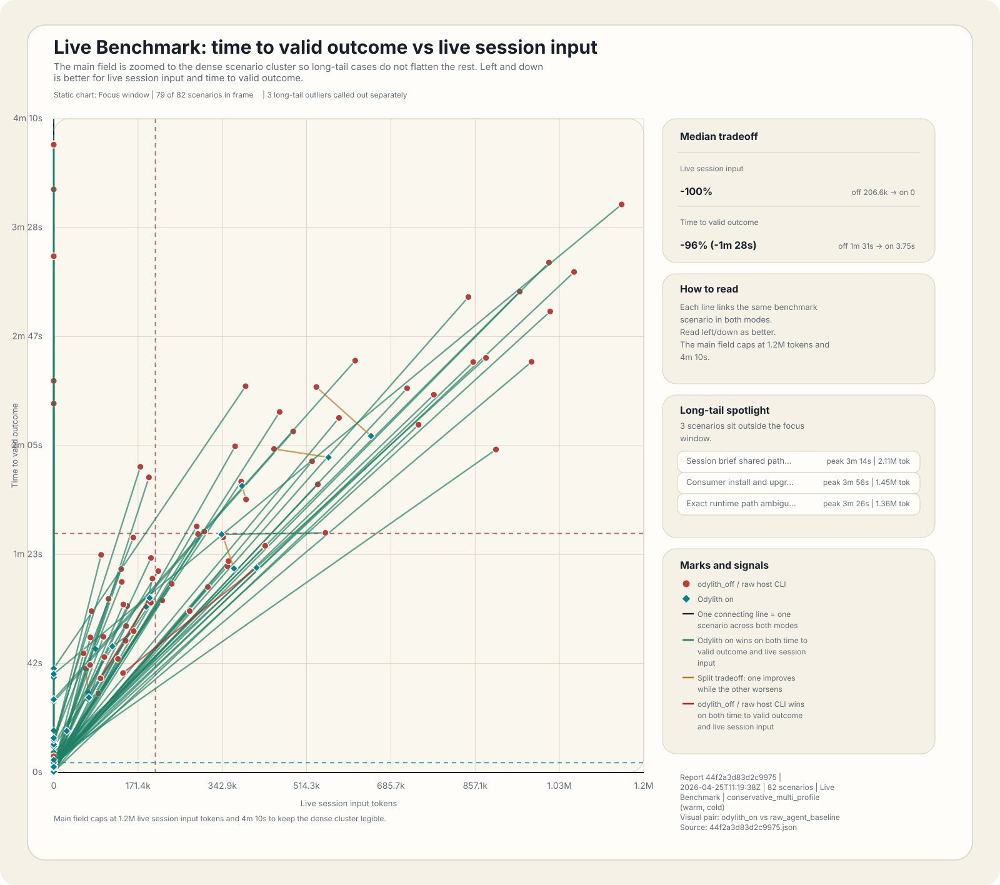
</p>
<p align="center">
  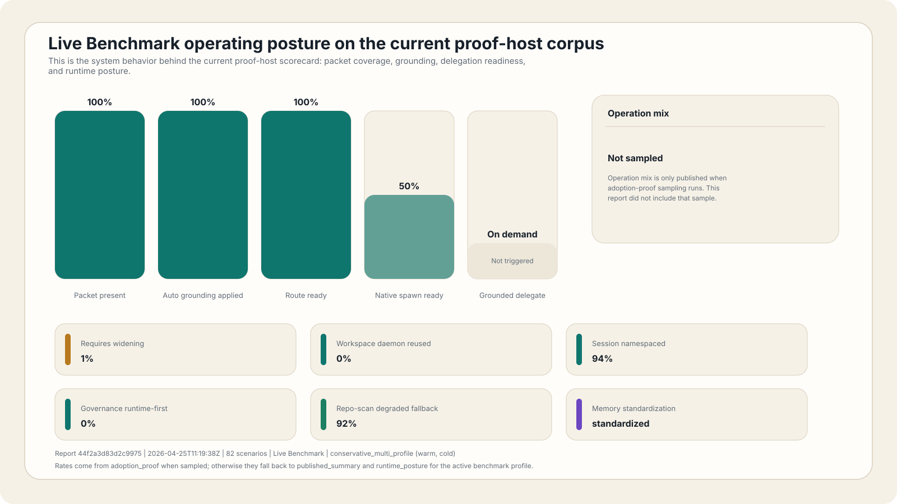
</p>

### v0.1.10 Benchmark Archive

The previous README-backed benchmark bundle is retained under
[docs/benchmarks/v0.1.10](docs/benchmarks/v0.1.10/README.md) instead of being
mixed into the current v0.1.11 claim.

- archived live proof snapshot: report `2d8444952aef28d2`, generated
  `2026-04-24T00:57:09Z`, status `hold`
- archived Grounding Benchmark snapshot: report `dd35a4aab061f49f`, generated
  before the v0.1.11 refresh
- archived legacy graph set: report `926bfeab4e887ade`, retained from the
  older unprofiled graph filenames

<details>
<summary>v0.1.10 archived live graphs</summary>

<p align="center">
  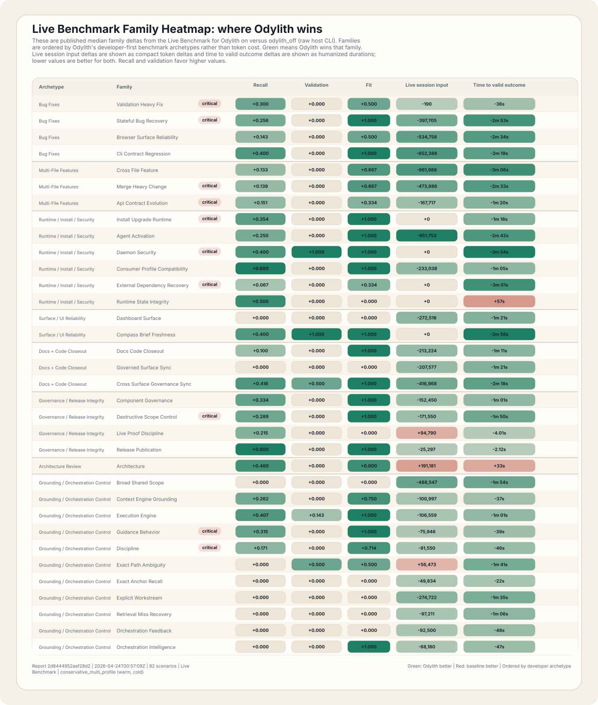
</p>
<p align="center">
  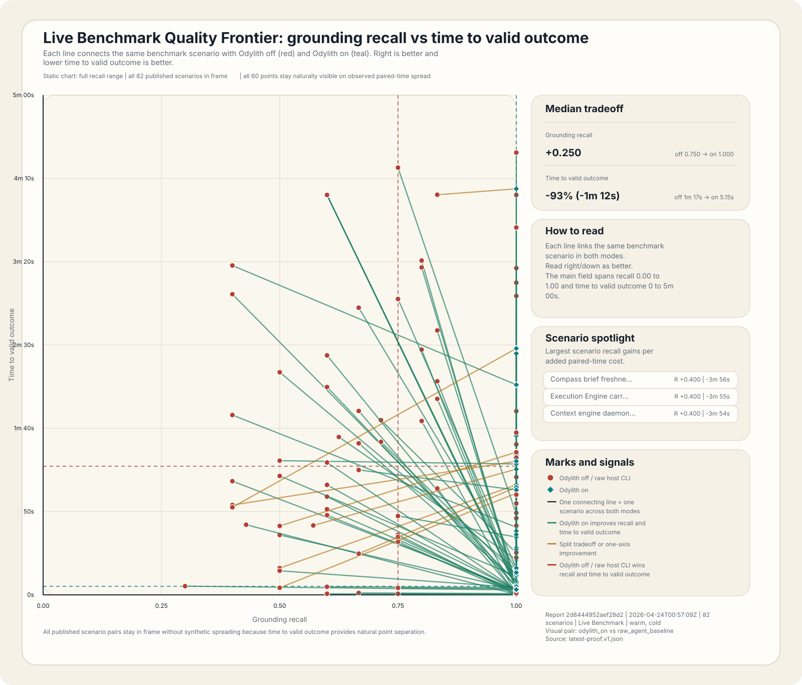
</p>
<p align="center">
  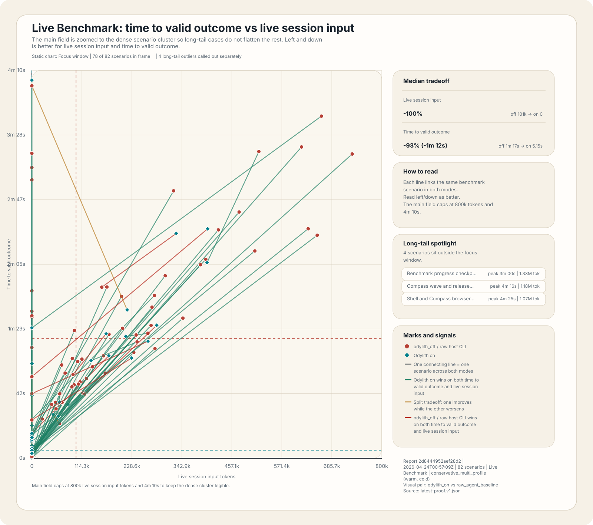
</p>
<p align="center">
  
</p>

</details>

## Best Fit Use Cases

Odylith is strongest when:

- the work spans multiple files, contracts, or governance surfaces
- the repo is large enough that boundaries, ownership, bug history, and
  execution state matter
- you want specs, plans, component inventory, diagrams, and bug history to
  live beside the code instead of across separate SaaS tools
- you want recent execution and decisions visible in Compass instead of buried
  in terminal history

Odylith is not meant to replace direct file reads for tiny obvious edits. It is
most useful when the repo is large enough that repo memory, topology, workstream
state, and execution history start to matter.

## Odylith Governs Itself

This repo also uses Odylith on itself.

| Surface | Product-Owned Truth |
| --- | --- |
| Radar | `odylith/radar/` |
| Atlas | `odylith/atlas/` |
| Compass | `odylith/compass/` |
| Registry | `odylith/registry/` |
| Casebook | `odylith/casebook/` |

## Read Next

- [First Run In An Odylith Repo](odylith/README.md#first-run)
- [FAQ](odylith/FAQ.md)
- [Operating Model](odylith/OPERATING_MODEL.md)
- [Product Components](odylith/PRODUCT_COMPONENTS.md)
- [Advanced Operator Use Cases](docs/ADVANCED_OPERATOR_USE_CASES.md)
- [Governance Surfaces](odylith/surfaces/GOVERNANCE_SURFACES.md)
- [What Gets Installed](docs/specs/odylith-repo-integration-contract.md#what-gets-installed)
- [Repo Integration Contract](docs/specs/odylith-repo-integration-contract.md)
- [Install and Upgrade Runbook](odylith/INSTALL_AND_UPGRADE_RUNBOOK.md)
- [How To Read Odylith's Benchmark Proof](docs/benchmarks/README.md)
- [Project Status And Disclosures](docs/STATUS_AND_DISCLOSURES.md)
