# ODYLITH

## From abundant intelligence to controlled consequence

### Adversarial market, product, and investment dossier

**Decision date:** 3 August 2026  
**Prepared for:** Founder and investment committee  
**Decision posture:** Conditional build / milestone-gated investment  
**Evidence cutoff:** 3 August 2026  

> Intelligence is becoming abundant. Consequence is not. Odylith should exist only if enterprises will pay it to bind autonomous work to an accountable mandate, route that work through an approved execution and proof path, and make its receipt a required condition for the change to proceed.

---

## How to read this dossier

This is not a product benchmark, a review of whether the present product is built, or a defense of the original deck. It is a decision document about the company thesis.

Every material statement is classified as one of four things:

- **Observed fact:** supported by a dated primary or authoritative source.
- **Inference:** a conclusion drawn from multiple facts; it may still be wrong.
- **Planning assumption:** a number or behavior used to design an experiment, not a market fact.
- **Product-will:** a market behavior Odylith would have to create rather than merely discover.

The analysis used six independent research tracks and a separate adjudication track: enterprise buying and revenue, market formation and game theory, technology and superintelligence, incumbent counterstrategy, a CISO/buyer review, and an existential falsification review. The adversarial record appears near the end.

---

# 1. One-page decision memo

## The decision

**Build now, but do not build the broad platform described in the original pitch. Finance a 90-day paid falsification program for one narrow product: Modernization Execution Assurance.**

Odylith should be a customer-controlled, cross-vendor execution-contract runtime. It binds an approved work item to permitted agents, tools, data, credentials, spend, evidence, owners, and escalation rules before execution; reconciles the resulting change and evidence afterward; and emits a signed decision receipt. The first paid use case is a repeated Java/Spring runtime or framework modernization campaign inside a regulated GitHub Enterprise estate.

This is not a Java migration company. Java/Spring is the first work class because the task is repeated, budgeted, bounded, and comparatively verifiable. The platform arc is broader:

1. **Land with evidence:** one modernization campaign, shadow mode, fixed paid pilot.
2. **Gain admission:** become a required status for a narrow, customer-authored deterministic change class.
3. **Move upstream:** bind work, authority, tools, spend, and proof before the agent runs.
4. **Route execution:** choose among approved human, internal-agent, and vendor-agent paths using policy, cost, evidence capability, and observed performance.
5. **Create private supply:** accept binding standing offers only after standardized demand and multiple accountable routes exist.
6. **Auction selectively:** use private bidding only where capacity or price dispersion makes it better than standing allocation.

Do not start with a public marketplace, a clearinghouse, a model router, a generic AI control tower, or raw agent FinOps. Do not charge by outcome.

## Why now

**Observed fact:** Microsoft reported nearly 140,000 organizations using GitHub Copilot in FY2026 Q3, enterprise subscribers nearly tripling year over year, and a majority of users using multiple models [S1]. GitHub now puts Claude, Codex, and Copilot into one governed workflow and has made its agent control plane generally available [S2, S3]. Salesforce reported 29,000 Agentforce deals and $800 million of Agentforce ARR in FY2026 [S4].

**Inference:** autonomous execution is no longer a hypothetical supply market. The immediate issue is that production authority, evidence, accountability, and budgets remain fragmented across enterprises even as workers proliferate.

**Observed fact:** GitHub, AWS, Microsoft, Google, ServiceNow, Salesforce, IBM, Snyk, and specialist gateways are already bundling routing, registries, policy, evaluations, observability, and governance [S3, S5-S12]. This means generic governance and routing are validated needs but poor independent company categories.

**Inference:** Odylith must control a cross-platform consequence boundary that the worker or producing platform cannot credibly own alone.

## What the enterprise hears

> Your agents can all produce changes. Odylith makes sure every change was authorized, stayed inside its operating envelope, produced the evidence your organization requires, and can be admitted through the same policy—regardless of which agent, internal team, or vendor did the work.

## What the investor hears

> Odylith is the buyer-side assurance router for autonomous work. It starts as a required execution contract and evidence gate for software modernization, then moves upstream into cross-agent assignment and downstream into portable receipts. If autonomous work becomes a real private market, Odylith already controls the qualified order flow; if no market forms, the required assurance product must still stand alone economically.

## First paid offer

**Modernization Execution Assurance Pilot**

- Planning price: **$75,000 paid upfront**.
- Duration: **90 days**.
- Customer: payments/fintech software company; 500-3,000 developers; GitHub Enterprise; 100+ JVM services; active Java/Spring modernization; at least three executor types.
- Scope: 50 repositories, one target-state contract, up to 500 eligible changes, customer-hosted runner, metadata-only control plane.
- Promotion: retrospective baseline, live shadow, then required status on at least ten repositories for customer-authored deterministic rules.
- Odylith writes no migration code, repairs no tests, owns no production credentials, and makes no final business-risk decision.
- Annual production option: planning range **$150,000-$240,000**, based on governed repositories, campaign classes, deployment, evidence retention, and support—not outcomes.

## Investment gates

The 90-day program succeeds only if:

1. Three of fifteen qualified accounts pay for the pilot from platform or modernization budgets.
2. At least two unrelated customers make Odylith a required control for a bounded production-impacting class.
3. The residual value survives comparison with a properly configured GitHub + CI + Snyk/Semgrep + Moderne/Amazon Q baseline.
4. Deterministic false denial is below 0.5%; escalation is below 25%; bypass is below 5%.
5. At least 70% of contract/evidence primitives transfer without custom code; the second customer is live in fewer than ten engineering days.
6. At least two pilots convert to six-figure annual subscriptions.
7. At least one security, audit, or risk owner accepts the receipt against a named control or evidence requirement.

If customers buy reports but refuse mandatory placement, Odylith is a dashboard. If native controls satisfy the residual gap, Odylith is a feature. If every repository needs custom semantics, Odylith is consulting. In any of those cases, stop.

---

# 2. Executive verdict

## The original thesis is directionally right and strategically incomplete

The core provocation survives:

> As intelligence becomes abundant, supply commoditizes. The scarce advantage moves to whoever can formulate demand, verify outcomes, and exploit price-performance mispricing.

But three corrections are required.

First, formulation and cognitive verification are not permanently scarce. Better frontier systems, specification tools, long context, self-routing, generated evaluators, and open protocols attack both. They can be useful capabilities, not terminal moats.

Second, a price-performance mismatch is useful only when the buyer can define the work, observe the result, and switch among genuinely eligible routes. Otherwise apparent mispricing is latent task difficulty, hidden human rescue, different tools, different permissions, or a vendor subsidy.

Third, a market does not appear merely because many agents exist. A market requires standardized demand, binding supply, comparable obligations, cheap adjudication, and enough independent routes to prevent a preferred-vendor rule from masquerading as liquidity.

The corrected thesis is:

> As intelligence becomes abundant, the scarce enterprise resource is permission to create consequence. The durable buyer-side platform binds an accountable mandate to an admissible execution path, constrains authority and spend, requires independent evidence, and records the decision across providers and systems of record.

Routing is still central, but the routed object changes. Odylith routes:

- work to eligible executors;
- authority to the least-privileged identity;
- proof to the appropriate deterministic and independent verifiers;
- approvals to accountable roles;
- budgets to sanctioned attempts;
- uncertain cases to humans;
- accepted consequences into authoritative systems.

## Investment posture

The correct investment decision is **conditional build**, not unconditional conviction and not passive waiting.

The bear case is strong: GitHub, clouds, ServiceNow, Salesforce, IAM systems, and policy engines can assemble much of the surface; enterprises may refuse to delegate a mandatory decision; and a code wedge can become a services-heavy adjacent tool. The bull case is nevertheless investable because a narrow required boundary can be tested quickly with paid customers and because failure is legible.

The investment buys the right to test institutional standing. It does not assume a future marketplace.

## Explicit rejections

Odylith should not be presented as:

- an adaptive inference control plane;
- an intelligence allocator;
- a general agent operating system;
- an AI control tower;
- a better coding agent;
- an LLM evaluator marketplace;
- a public reverse auction;
- a financial clearinghouse;
- an outcome-underwriting company;
- a token-savings FinOps dashboard.

These either collide directly with bundled incumbent features, require markets that do not yet exist, create liability the company cannot price, or are hard for an enterprise buyer to understand.

---

# 3. Thesis surgery: what survives, what dies, what changes

| Original idea | Decision | Reason |
|---|---|---|
| Multi-model and multi-agent execution will proliferate | Retain | Supported by current enterprise adoption and platform behavior [S1-S3]. |
| Route every model call for price/performance | Reject as category | Commodity gateways and native routers already do this [S13-S16]. |
| Formulate demand as the scarce layer | Retain as governed object, not moat | Models can draft specifications; accountable mandate and conflict resolution remain institutional. |
| Verify outcomes | Narrow | Deterministic and authoritative evidence matters; another model's opinion alone is not independent proof. |
| Learn which route works | Retain conditionally | Requires causal controls, assignment probabilities, human-cost accounting, and delayed outcomes. |
| Reverse auction for execution | Defer | There is no binding, liable, liquid task-level supply today. |
| Clearinghouse | Reject as planned destination | Existing payment rails settle money; central-counterparty economics require legal finality, collateral, and default management [S17-S20]. |
| Outcome pricing | Reject | Attribution is confounded and the user explicitly does not want it. |
| Software as beachhead | Retain | Software has enforceable gates, versioned artifacts, repeated changes, and comparatively objective evidence. |
| Coding as company identity | Reject | GitHub enclosure and coding-agent bundling make it strategically fragile. |
| Private buyer-side facility | Retain as architecture | It is viable only after a bounded work class creates mandatory flow. |
| Independent authority | Modify | Customer remains sovereign. Odylith computes and attests under customer-owned policy; customer systems enforce. |

---

# 4. Present market: the play-by-play

## 4.1 Supply is already abundant enough to create operational tension

**Observed fact:** GitHub now exposes Claude, Codex, and Copilot within a shared enterprise workflow [S2]. Microsoft says a majority of Copilot users use multiple models [S1]. OpenAI, Anthropic, GitHub, GitLab, AWS, and Google each offer long-running agent execution, tools, orchestration, governance, or modernization [S2, S5-S10, S21-S24].

**Inference:** the relevant supply side is not just frontier models. It is composite execution routes:

    agent + model + runtime + tools + data access + permissions
    + verifier + human fallback + recovery capacity

Two agent brands running the same model in the same cloud with the same verifier are correlated supply, not true diversification.

## 4.2 Enterprise demand is work plus institutional constraints

The demand object is not a prompt. It is a principal-backed request for a state transition under:

- an accountable owner;
- target scope and exclusions;
- budget and deadline;
- permitted systems and data;
- risk classification;
- required evidence;
- escalation and exception rules;
- recovery conditions;
- an acceptance boundary.

This definition incorporates the user's desired demand-side emphasis—problem formulation, solution verification, and local mispricing—but expresses it as an enterprise-operable contract.

## 4.3 Spend is real, but raw spend control is not enough

**Observed fact:** GitHub and other coding-agent providers have moved toward pooled credits and usage billing; GitHub Business and Enterprise include usage credits, and heavy automated users can consume disproportionate pooled budgets [S25-S28].

**Inference:** a 1,000-developer enterprise can plausibly carry several hundred thousand to more than a million dollars of annual coding-agent, API, security, CI, and overlapping tool spend. This is a bottom-up possibility, not an estimate of a typical account.

Agent FinOps is therefore a legitimate problem. But the natural path of a FinOps product is:

    execution happens → provider bills → dashboard attributes

Odylith's desired position is:

    work is authorized → route is selected → authority is issued
    → evidence is required → change is admitted or escalated

FinOps can be a signal in the execution contract. It cannot be the wedge because it observes after the critical decision and is being rapidly bundled.

## 4.4 Governance demand is real and overcrowded

**Observed fact:** GitHub's agent control plane provides policy, activity, audit, third-party-agent visibility, and MCP controls [S3]. AWS places deterministic policy outside agent code [S5]. ServiceNow claims cross-system discovery, governance, shutdown, and value measurement [S11]. Microsoft, Google, IBM, Salesforce, Snyk, and Glean offer overlapping control or lifecycle surfaces [S6-S10, S12, S29].

**Inference:** no investor should underwrite “enterprises need agent governance” as sufficient differentiation. The wedge must be a required, cross-vendor execution contract and decision at a consequence boundary.

## 4.5 Modernization is a paid, repeated work class

**Observed fact:** AWS, Microsoft/GitHub, Amazon Q, and Moderne already sell or provide software-modernization tooling; Java and .NET support cadences create repeated deadlines [S22-S24, S30-S34].

**Inference:** generation supply is validated. The unproven residual demand is one supplier-neutral definition of what counts as admissible across a campaign.

This is why modernization is the opening. It has:

- funded programs and deadlines;
- repeated changes across many repositories;
- bounded target states;
- build, test, dependency, API, license, security, and provenance evidence;
- existing status-check enforcement;
- multiple possible executors;
- enough economic value for a paid enterprise pilot.

## 4.6 The present money map

| Spend pool | Economic buyer | Operational owner | Odylith position |
|---|---|---|---|
| Modernization program | CIO, VP Engineering, transformation leader | Platform/app modernization | Initial paid wedge |
| Developer agents and model usage | CTO, VP Engineering | AI/developer platform, FinOps | Cost and eligibility signal |
| DevSecOps and AppSec | CISO, VP Engineering | AppSec/platform | Evidence source and co-sponsor |
| Source control and CI | CIO, VP Engineering | Developer platform | Enforcement surface, not displaced |
| GRC/audit/change control | Risk, internal audit | Control owners | Receipt consumer and possible expansion |
| Infrastructure and data change | CTO/CIO/CISO | Platform/SRE/data platform | Second consequence class |
| Agent procurement and private supply | CIO/procurement | AI platform | Later qualified route facility |

---

# 5. Market topology: who is on each side?

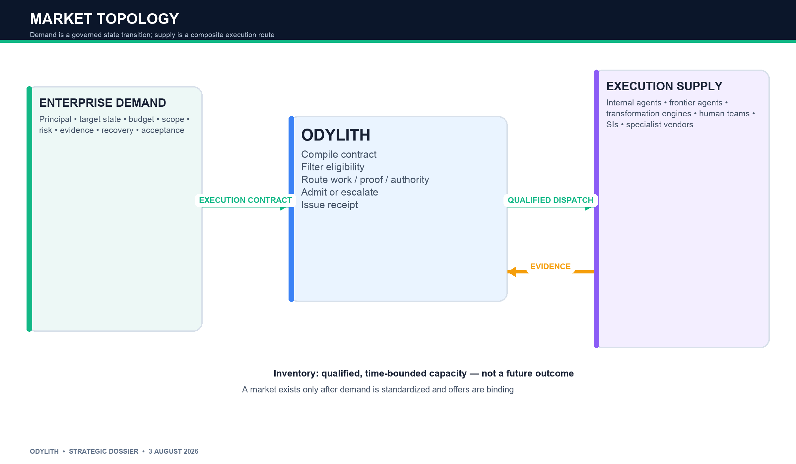

## Demand side

The demand-side principal is the enterprise. A user or internal agent may submit work, but the enterprise owns the money, systems, and residual risk.

Demand participants include:

- business or engineering owner who wants the state change;
- platform or modernization team that operates the campaign;
- CISO/AppSec that defines prohibited actions and evidence;
- enterprise architecture that defines target state;
- repository/service owners that retain final accountability;
- finance/procurement that owns budget and supplier terms;
- audit/risk that consumes the receipt.

## Supply side

Supply is a route, not merely a model:

- internal human team;
- internal agent built by the enterprise;
- frontier coding agent;
- cloud modernization agent;
- deterministic transformation engine;
- systems integrator or specialist vendor;
- composite path combining agent, verifier, human repair, and rollback.

## Inventory

The ex-ante inventory is not “a verified outcome.” That outcome does not exist. The inventory is:

> Qualified, time-bounded capacity to attempt a defined execution contract under stated service, evidence, data, authority, and recovery conditions.

## Bid

At maturity, a binding offer could contain:

- price;
- available capacity;
- completion band;
- agent/model/runtime identity;
- requested permissions;
- data and jurisdiction conditions;
- evidence deliverables;
- re-execution or service-credit obligation;
- limited performance bond.

Supplier-reported probability of success is not a credible bid unless collateralized. Odylith must estimate task-conditional reliability independently.

## Clearing

Choosing a route is allocation, not financial clearing. Odylith should reserve the word “clearinghouse” for the remote future in which it legally intermediates multilateral obligations, holds collateral, and manages defaults. Nothing in the current market warrants that position.

---

# 6. Money, authority, and evidence flows

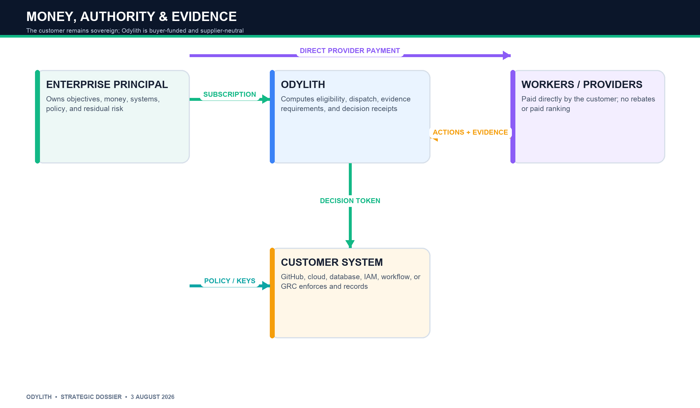

The enterprise pays Odylith a fixed platform subscription and continues to pay workers, models, and clouds directly. Odylith receives no supplier rebate and does not mark up inference. This preserves buyer-side neutrality.

The enterprise delegates a bounded policy function, not sovereignty. Customer policy and keys remain authoritative. Odylith returns a decision token and signed receipt. The source-control, cloud, data, or workflow system enforces the decision.

The core separation is:

    principal defines mandate
    worker proposes consequence
    independent evidence is gathered
    Odylith evaluates admissibility under customer policy
    customer system enforces
    accountable human or role retains final responsibility

This arrangement allows a startup to block deterministic, reversible breaches without claiming to own business-risk acceptance.

---

# 7. Why frontier models do not already eliminate the company

The weak answer is that models remain unreliable. That answer expires.

The stronger answer is structural.

| Function | Frontier systems increasingly do | What they cannot legitimately manufacture | Odylith's role |
|---|---|---|---|
| Formulate | Interview, specify, decompose, generate tests | Stakeholder agreement, accountable mandate, legitimate priority | Preserve principal, scope, approvals, assumptions, and change history |
| Route | Select models, tools, agents, fallbacks | Conflict-free ranking when the provider sells supply; organizational authority | Apply buyer-owned eligibility and utility across routes |
| Verify | Test, simulate, review, use judges | Independent evidence of its own conduct; legal acceptance | Require heterogeneous or deterministic proof and external state |
| Authorize | Recommend and ask for consent | Self-granted credentials, risk appetite, separation of duties | Compile the mandate into bounded authority and a consequence decision |
| Learn | Use traces and feedback | Portable institutional memory under customer control | Retain policy, exception, failure, and outcome history across vendors |

**Observed fact:** AWS explicitly positions AgentCore Policy outside agent code so the model cannot reason around it [S5]. GitHub does not let Copilot review satisfy required human approval and constrains self-approval for agent-authored changes [S35-S37]. NIST has identified identity, authority, monitoring, and evaluation-gaming problems for software agents [S38-S41].

**Inference:** even excellent intelligence remains distinct from institutional authority unless enterprises and law accept the provider as actor, judge, authorizer, and warrantor. That institutional separation is the actual Odylith hypothesis.

---

# 8. Intelligence cost, Jevons effects, and value migration

## 8.1 “Cost goes to zero” is true for yesterday's cognition and false for total outcomes

**Observed fact:** Stanford documented dramatic benchmark-adjusted declines in inference cost, while price dispersion across frontier and open systems remains large [S42-S44]. At the same time, Microsoft and other providers continue to invest heavily in AI infrastructure, and the IEA projects substantial growth in data-center electricity demand [S45-S47].

The economically relevant equation is:

    total outcome cost = model tokens + trajectories + tools + context
    + integration + evaluation + supervision + failures + liability
    + organizational change

As unit intelligence becomes cheaper, enterprises can afford more attempts, longer trajectories, richer context, multiple agents, and more verification. Total consumption may rise faster than price falls.

## 8.2 The rebound sequence

1. Better price-performance makes previously uneconomic tasks viable.
2. More employees and workflows receive agents.
3. Agents create more proposed actions and integrations.
4. Enterprises run competing trajectories and generated evaluators.
5. Quality expectations rise because AI output is compared with other AI output.
6. Compute, authorization, observability, exception handling, and liability spend expand.

**Inference:** lower model cost strengthens the number-of-actions problem. It weakens raw routing margins but may strengthen the need for controlled consequence.

## 8.3 Scarcity migration

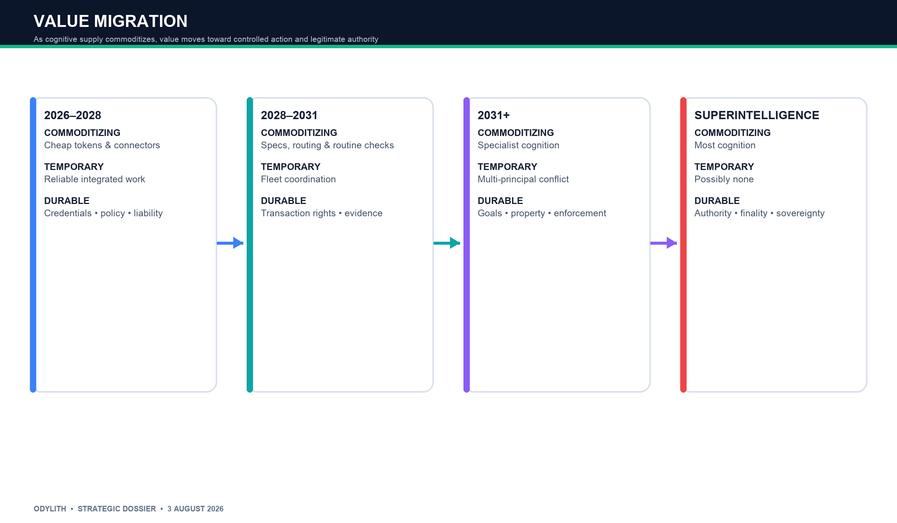

| Period | Commoditizing | Temporary scarcity | More durable scarcity |
|---|---|---|---|
| 2026-2028 | Tokens, connectors, basic routing, first-pass specs | Reliability, clean context, integration, evaluation | Credentials, policy ownership, authority, liability |
| 2028-2031 | Formulation, routine verification, agent construction | Fleet coordination, containment, cross-model observation | Transaction rights, independent evidence, identity, risk capital |
| 2031+ plural advanced systems | Specialist cognition and orchestration | Constitutional conflict resolution | Legitimate goals, property rights, enforcement, political consent |
| Superintelligence | Formulation, execution, optimization, cognitive checking | Potentially none in cognition | Physical resources, authorization, finality, sovereignty, separation of powers |

Odylith therefore cannot base terminal value on being more intelligent than the workers. It must bind to credentials, systems, policy, and evidence outside the worker's narration.

---

# 9. Seven future worlds, played forward

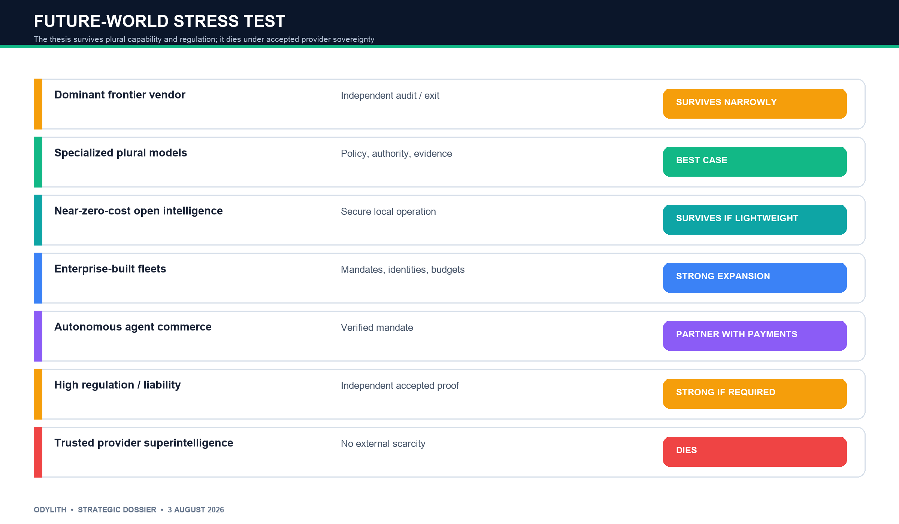

## 9.1 Dominant frontier vendor

**Trigger:** one provider sustains a capability and distribution lead.

**Play-by-play:**

1. The provider subsidizes basic cognition and bundles agents, identity, context, verification, and enterprise terms.
2. Buyers consolidate for reliability and procurement convenience.
3. The provider adds warranties, richer telemetry, and native authorization.
4. Independent routing disappears.
5. Odylith survives only where regulators, insurers, customers, or counterparties require evidence and authorization outside the producing platform.

**Death condition:** the enterprise accepts the provider as actor, verifier, authorizer, recorder, and warrantor.

## 9.2 Specialized plural models

1. Several frontier, sovereign, open, and specialist systems remain economically relevant.
2. Raw inference margins compress.
3. Enterprises maintain approved portfolios for cost, jurisdiction, latency, privacy, and domain performance.
4. Model selection becomes table stakes.
5. Stable policy, authority, and longitudinal evidence above vendors gain value.

This is the strongest conventional world for Odylith.

## 9.3 Near-zero-cost open intelligence

1. Open models become adequate for most work and run locally.
2. Closed vendors compete on reliability, tools, support, safety, and indemnity.
3. Enterprises self-host high-volume or sensitive workloads.
4. Model spend falls as a share of total cost; secure operations, compute, policy, and accountability grow.
5. Odylith survives only if it runs locally with low overhead and governs mixed open/closed fleets.

## 9.4 Enterprise-built agent fleets

1. Business units build agents faster than central teams can inventory them.
2. Duplicate and shadow agents proliferate.
3. Incidents and budget pressure force service identities, owners, budgets, SLAs, escalation, and retirement.
4. Security and FinOps converge around nonhuman actors.
5. Odylith can expand from software contracts into fleet mandates and action receipts.

## 9.5 Autonomous agent commerce

1. MCP/A2A standardize interaction; Stripe, Visa, Mastercard, and others standardize machine payments and agent authorization [S17-S20, S48-S50].
2. Agents buy APIs, data, compute, and services.
3. Payments move easily, but disputes focus on whether a mandate authorized the commitment and whether the obligation was fulfilled.
4. Odylith can supply policy and evidence, but should not rebuild payment rails.

## 9.6 High regulation and liability

1. Incidents make provider self-attestation less acceptable.
2. Enterprises centralize control and require independent assessment, locked versions, and retained evidence.
3. Auditors and insurers accept standardized receipts for some classes.
4. Odylith's institutional value rises if its record is reproducible and externally accepted.

**Caution:** regulation does not automatically require an external vendor. Internal controls and incumbent GRC may be sufficient [S51-S54].

## 9.7 Superintelligence

1. Formulation, coding, orchestration, and cognitive verification approach zero marginal cost.
2. Enterprises delegate entire functions rather than individual tasks.
3. Rent migrates to the SI owner, compute and energy, physical assets, licenses, liability capital, and transaction networks.
4. A software-only Odylith dies unless it constrains real credentials, money, compute, or actuators; writes evidence outside the SI's unilateral control; and is required by independent principals.

The superintelligence hedge is therefore low confidence. It is not a slogan. It is a falsifiable institutional bet on separation of powers.

---

# 10. Counterfactuals that kill the thesis

The company should be designed around the possibility that it should not exist.

## Counterfactual A: one platform is good enough

Most consequential enterprise work consolidates in GitHub/Microsoft, one cloud, or one business-workflow platform. Native policy, evaluation, billing, and signed logs satisfy buyers. Cross-platform neutrality has no funded owner.

**Result:** no company, or a small integration feature.

## Counterfactual B: enterprises refuse delegated mandatory placement

Customers enjoy shadow insights but will not let Odylith block, stop, or escalate even deterministic classes.

**Result:** dashboard. Stop.

## Counterfactual C: policies do not generalize

Every repository, workflow, or customer requires a new ontology, bespoke tests, and manual evidence interpretation.

**Result:** consulting or managed services, not a high-margin platform.

## Counterfactual D: verification becomes free and institutionally accepted

Frontier models generate near-perfect tests and explanations; provider-native attestations are accepted by auditors and insurers.

**Result:** Odylith's independent proof claim compresses to customer policy plumbing.

## Counterfactual E: intelligence and supply converge

One route wins more than 80% of eligible work after risk and cost; alternatives share the same model, cloud, and verifier.

**Result:** routing is a preferred-vendor rule, not a market.

## Counterfactual F: outcome truth remains inaccessible

Odylith sees merge and test status but not deployment, rollback, incident, or human repair. Its outcome graph learns selected proxies.

**Result:** no performance-data moat; retain policy product only if independently valuable.

## Counterfactual G: customer-operated policy wins

OPA, Cedar, IAM, rulesets, internal workflow, and data warehouses give enterprises an adequate contract and receipt system.

**Result:** an open standard or implementation service dominates a standalone vendor.

## Counterfactual H: the wedge never leaves GitHub

The code product succeeds, but evidence begins and ends inside GitHub. The platform copies it or acquires it.

**Result:** valuable niche or acquisition, not the broad independent company.

---
# 11. Strategic alternatives and adjudication

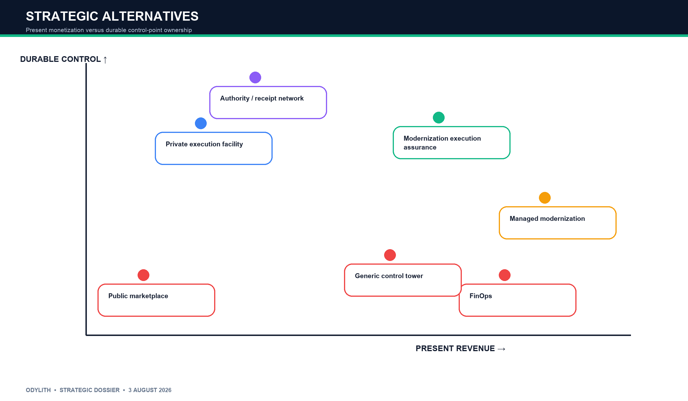

The alternatives were evaluated against present budget, time to revenue, control-point ownership, incumbent exposure, product repeatability, routing continuity, gross-margin risk, and superintelligence resilience.

| Rank | Alternative | Present revenue | Strategic control | Incumbent exposure | Decision |
|---:|---|---|---|---|---|
| 1 | Modernization Execution Assurance | Paid pilot from modernization/platform budget | Pre-execution contract + admission + receipt | High, but a cross-vendor seam exists | Build conditionally |
| 2 | Private Execution Facility | Unclear before a work class exists | Strongest terminal architecture | Extreme if sold generically | Destination, not wedge |
| 3 | Agent FinOps + shadow routing | Fast read-only sale possible | Observes after assignment; weak authority | Extreme | Feature only |
| 4 | Generic independent change assurance | Six-figure potential | Required consequence boundary | Crowded and abstract | Product architecture, not initial pitch |
| 5 | Managed modernization execution | Fast services revenue | Owns delivery, not neutral control | SIs/clouds; margin pressure | Reject as core; partner channel |
| 6 | Agent marketplace | No proven task liquidity | Could own demand if it existed | Cloud/application marketplaces | Defer indefinitely |
| 7 | Clearing / underwriting | No credible loss or default data | High theoretical rents | Financial/regulatory incumbents | Reject now |

## Why agent FinOps is a detour, not a bridge

FinOps has immediate language, data, and budget urgency. But it reaches a different destination. It sells to billing and platform administrators, ingests usage after execution, and optimizes consolidation. To become Odylith's desired authority layer, it would need a new buyer, repository and CI access, an enforcement position, availability obligations, task semantics, and an entirely new procurement review. The first wedge does not remove the hard transition.

Use cost attribution inside the execution contract. Do not let it define the company.

## Why the broad private facility is too early

Asking an enterprise to redirect heterogeneous work into a new platform before a bounded value proposition creates circular adoption:

    no standardized demand → no comparable supply → no useful routing
    → no reason to centralize demand

The modernization gate breaks the circle by acquiring a required decision over an existing work class. The private facility is then the architecture the product grows into.

## Why the evidence gate must include the pre-execution contract

A post-hoc GitHub check is easy to copy. The product becomes investable only when it governs both sides:

    approved demand and authority before execution
    + independent evidence and reconciliation after execution

This captures the durable work contract, makes spend attributable to authorized demand, and creates a routeable object. The result is not “AI checking AI.” Deterministic evidence can deny; uncertain cognition can only recommend escalation.

---

# 12. The initial product

## Product name

**Modernization Execution Assurance**

Category sentence:

> A customer-controlled execution-contract and admission system for cross-vendor autonomous software change.

Avoid “control plane.” That phrase is already owned by GitHub, Microsoft, Google, ServiceNow, IBM, and others. Avoid “independent authority” in external positioning because the customer remains responsible and may operate the enforcement locally.

## The product object: Execution Contract

Every governed task receives a signed, versioned contract containing:

- accountable human or organizational principal;
- approved work-item and target state;
- repositories, branches, paths, systems, and data in scope;
- permitted human, internal-agent, and vendor-agent executors;
- immutable provider/model/runtime/tool versions where observable;
- permitted MCP servers, network destinations, credentials, and data classes;
- token, dollar, time, and attempt envelope;
- prohibited actions and protected paths;
- required compilation, tests, compatibility, security, license, provenance, rollback, and owner evidence;
- deterministic deny rules;
- escalation triggers and named human authorities;
- expiry, supersession, revocation, and emergency bypass.

## The product object: Execution Receipt

The receipt records:

- contract hash and version;
- principal and delegated actor;
- input snapshot and artifact identifiers;
- tools, credentials, permissions, and environments used;
- attempts, retries, failures, and human interventions;
- evidence source, timestamp, signature, and result;
- exceptions and accountable approvers;
- ALLOW, DENY, REQUIRE_EVIDENCE, or ESCALATE;
- authoritative state transition;
- downstream deployment, rollback, incident, or dispute linkage when available.

The receipt should be portable and independently verifiable. OPA, Cedar, in-toto, SLSA, OpenTelemetry, MCP, and A2A are inputs or compatible primitives, not enemies. A proprietary JSON envelope is not a moat [S38-S41, S55-S58].

## What may block

Initial automatic blocks must be reversible, deterministic, and customer-authored:

- missing, expired, altered, or mismatched contract;
- unauthorized repository, branch, path, executor, tool, network destination, credential, or data class;
- exhausted execution budget for future attempts;
- prohibited dependency, license, secret, unsigned provenance, or mandatory-test failure;
- absent required owner, compatibility, security, rollback, or evidence record;
- destructive action outside an explicit capability envelope.

## What must not block or decide

Odylith must not decide:

- business priority or human-headcount allocation;
- product or architectural trade-offs;
- final merge or production deployment directly;
- emergency-response judgment;
- regulatory accountability;
- any hard denial based solely on model confidence;
- retrospective validity of correct work merely because generation overspent.

## Deployment posture

1. Customer-hosted ephemeral runner clones and evaluates source.
2. Metadata-only control plane retains policy version, evidence hashes, reason codes, approvals, timing, and receipt.
3. No persistent source storage by default.
4. No production, merge, cloud-admin, or secret-write authority.
5. GitHub App writes one named required status.
6. Existing CI, SAST, SCA, SBOM, secret, license, contract-test, and service-catalog systems remain authoritative evidence sources.
7. Customer-owned keys and local enforcement are available.
8. Logs export to customer SIEM/GRC.
9. Dual-approved break-glass is always attributable and time-bounded.

## Minimum enterprise posture

- SAML SSO, SCIM, RBAC, audit API;
- no training on customer source or metadata;
- DPA, subprocessor inventory, regional retention and deletion;
- customer-managed keys and private deployment option;
- incident notification, vulnerability disclosure, pen-test summary;
- evidence export and termination plan;
- model/provider inventory;
- business-continuity and fail-safe operation;
- explicit statement that customer retains legal and release responsibility.

---

# 13. Exact initial customer and buying motion

## Ideal customer profile

- payments, fintech infrastructure, card processing, or digital-banking software company;
- United States or European Union;
- 500-3,000 developers;
- GitHub Enterprise Cloud;
- 100+ Java/Spring services;
- active, funded Java LTS, Spring Boot, API, or dependency-security campaign;
- at least three executor types: deterministic migration tool, coding agent, internal/human/SI path;
- PCI DSS, DORA, or meaningful operational-risk obligations;
- central platform/app-modernization team and formal AppSec;
- reliable build, test, ownership, dependency, and policy metadata across a qualifying cohort.

Disqualify accounts that want a one-time report, lack a funded migration, will not precommit to bounded enforcement, or require Odylith to repair code and tests.

## Stakeholder map

| Stakeholder | Role | What must be true |
|---|---|---|
| Head of Platform/App Modernization | Champion | Owns campaign and workflow |
| VP Engineering / CIO delegate | Economic buyer | Controls tooling or modernization budget |
| CISO / AppSec | Co-sponsor and veto | Approves data flow, hard laws, incident posture |
| Enterprise Architecture | Target-state authority | Defines approved versions and exceptions |
| Code/service owners | Adoption veto and final accountability | Trusts the evidence and exception path |
| SCM/CI admins | Enforcement gatekeeper | Installs required status and runner |
| Change/release management | Process owner | Maps current change classes and bypass |
| Audit/risk | Receipt consumer | Names a control or evidence use |
| Privacy/legal/TPRM | Contract veto | Accepts data, subprocessor, continuity terms |

The CISO is not the sole natural buyer. A security-only pitch falls into Snyk/Semgrep comparisons. Land in an active modernization budget, with CISO and architecture co-ownership.

## Procurement play-by-play

1. Qualify the campaign, budget, executor plurality, and evidence maturity.
2. Sell a fixed $75,000 paid pilot with annual option; do not offer a free proof of concept.
3. Complete data-flow, DPA, no-training, retention, incident, and continuity review.
4. Deploy a customer-hosted runner and metadata-only control plane.
5. Baseline native GitHub, CI, Snyk/Semgrep, and modernization-tool controls before claiming residual value.
6. Run retrospective calibration and shadow mode.
7. Obtain customer approval for the exact deterministic hard laws.
8. Enable the required status on ten qualified repositories.
9. Run adversarial drills, outage/bypass rehearsal, and receipt reproduction.
10. Convert to annual production only if a control owner and economic buyer both sign.

The plausible pilot procurement cycle is 45-90 days for this account shape if source remains inside the customer environment. This is a planning inference, not observed Odylith sales data.

---

# 14. Ninety-day execution sequence

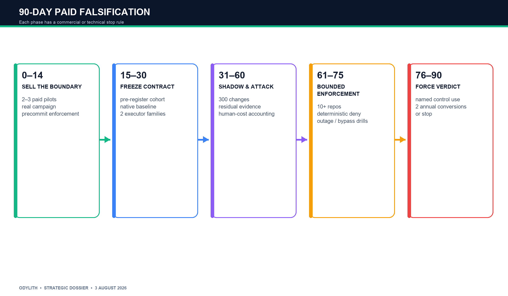

## Days 0-14: sell the boundary

- Interview fifteen tightly qualified modernization/platform/risk buyers.
- Present one concrete contract and receipt, not the whole market vision.
- Select a funded migration vector and actual repository cohort.
- Require a risk/audit stakeholder and written shadow-to-enforce path.
- Close at least two paid pilots; the commercial target is three.

## Days 15-30: freeze the contract and native baseline

- Pre-register eligible repositories and tasks before observing results.
- Document existing GitHub, CI, Snyk/Semgrep, Moderne/Amazon Q, and cost controls.
- Translate existing controls into one versioned campaign contract and a small number of risk profiles.
- Integrate one source-control system and at least two executor families.
- Reject the account if residual checks can be reproduced by existing tools with trivial configuration.

## Days 31-45: retrospective and shadow receipts

- Replay completed and in-progress migrations from immutable states.
- Process every eligible attempt, including failure, abandonment, override, and human rescue.
- Compare Odylith decisions with blind repository-owner/AppSec adjudication where practical.
- Emit signed receipts to the customer's CI/change/GRC evidence store.
- Prove the receipt without trusting the Odylith UI.

## Days 46-60: live shadow and falsification

- Process at least 300 eligible changes across customers.
- Attribute execution spend and attempts to authorized work.
- Identify residual material contract/evidence gaps missed by the configured native baseline.
- Measure evidence completeness, false escalation, human minutes, time to admissibility, and bypass pressure.
- Stop if unique residual value is cosmetic or predominantly documentation.

## Days 61-75: bounded enforcement

- Enable required status on at least ten repositories per committed enforcement customer.
- Allow deterministic deny only; uncertain AI classifications escalate.
- Keep high-risk changes in shadow-plus-human mode.
- Run fail-open/fail-closed and outage drills by change class.
- Revoke enforcement immediately if Odylith materially harms delivery or security.

## Days 76-90: commercial verdict

- Run drills for contract alteration, identity spoofing, exhausted budgets, missing evidence, stale approvals, unauthorized tools/paths, and emergency bypass.
- Have audit/control testing reproduce decisions without vendor assistance.
- Obtain written use of the receipt against a named control or process.
- Convert at least two customers to six-figure annual agreements.
- If the gates fail, stop. Do not retreat automatically to FinOps or generic governance.

---

# 15. Revenue staircase without outcome pricing

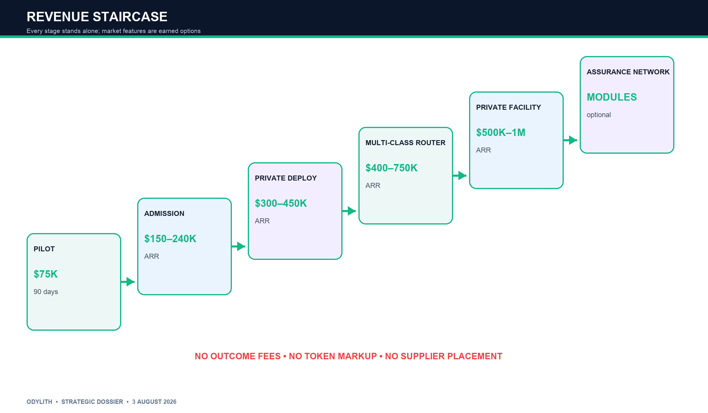

All prices below are planning assumptions to test, not observed willingness to pay.

| Stage | Offer | Pricing basis | Planning price | Standalone value |
|---|---|---|---:|---|
| 0 | Modernization Assurance Pilot | Fixed scope and term | $75K / 90 days | Paid falsification and integration |
| 1 | Production Admission | Governed repositories/campaigns | $150K-$240K ARR | Required evidence and decision control |
| 2 | Private/regulated deployment | Tenant isolation, CMK, SLA, retention | $300K-$450K ARR | Security and audit-grade operation |
| 3 | Multi-class Assurance Router | Additional change classes/environments | $400K-$750K ARR | Cross-domain policy and routing |
| 4 | Private Execution Facility | Qualified routes, capacity, dispatch | $500K-$1M ARR | Buyer-side allocation and evidence |
| 5 | Assurance ecosystem | Verifier registry, GRC/insurer interfaces | Module subscription/API bands | Institutional acceptance |

## Pricing principles

Charge for:

- governed scope and environments;
- contract and policy lifecycle;
- admission/verification event bands;
- evidence retention and audit access;
- private deployment and support;
- qualified-route and capacity modules later.

Do not charge for:

- percentage of savings or productivity;
- successful PR or business outcome;
- supplier placement or ranking;
- model-token markup;
- percentage of task value;
- insurance risk on Odylith's balance sheet.

## Pilot unit economics

Planning case for a $75,000 pilot:

| Direct cost | Planning assumption |
|---|---:|
| Solution/integration engineering | $14,000 |
| Infrastructure and evidence processing | $3,000 |
| Support and tenant operations | $4,000 |
| Total direct COGS | $21,000 |
| Gross profit | $54,000 |
| Pilot gross margin | 72% |

The mature target is greater than 80% gross margin with less than 0.1 engineer FTE per deployment. Kill or partner the work if Odylith must author tests, repair migrations, or translate policy manually.

## First-year scenarios

These are operating scenarios, not forecasts.

| Scenario | Paid pilots | Conversions | Average production ACV | Exit ARR | Interpretation |
|---|---:|---:|---:|---:|---|
| Bear | 2 | 0 | — | $0 | No independent category; stop |
| Validation | 3 | 2 | $180K | $360K | Authority and budget signal; continue narrowly |
| Base | 8 | 5 | $220K | $1.1M | Early repeatable company evidence |
| Bull | 15 | 10 | $300K | $3.0M | Strong regulated assurance wedge |

Services should remain below 20% of first-year contract value after the initial reference deployments. Customer-paid agent and model accounts protect gross margin.

---

# 16. Market formation, stage by stage

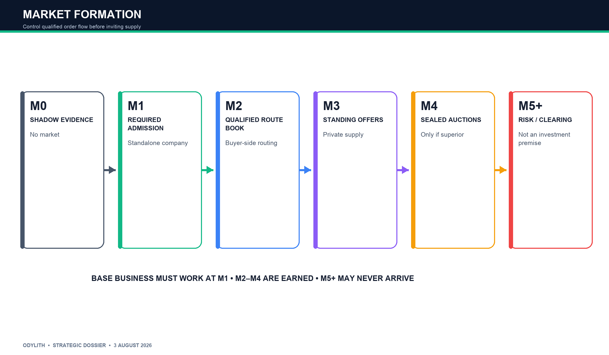

## Stage M0: shadow evidence

**Demand:** active modernization changes.  
**Supply:** existing agents, tools, teams, and SIs.  
**Inventory:** proposed changes and evidence packages.  
**Bid:** none.  
**Revenue:** fixed pilot and platform scope.  
**Market status:** no market.

Transition only if most work fits reusable contracts, determinations are reproducible, evidence overhead is acceptable, native baselines leave residual value, and a buyer precommits to enforcement.

## Stage M1: required admission

**Demand:** changes seeking merge/release progression.  
**Supply:** existing execution routes.  
**Inventory:** evidence-complete candidate state transitions.  
**Bid:** current supplier contract plus declared evidence plan.  
**Revenue:** annual platform, governed applications, evidence-event bands.  
**Market status:** buyer-controlled admission facility.

This stage must be a standalone business. Odylith now observes the entire defined cohort, including failure, override, missing evidence, and human rescue.

## Stage M2: qualified route book

Odylith moves upstream. Unassigned modernization lots enter as execution contracts. Approved routes advertise or inherit cost, capacity, completion, identity, permissions, evidence, recovery, and dependency conditions.

**Bid:** buyer-side synthetic route vector or supplier standing quote.  
**Inventory:** qualified attempt capacity.  
**Market status:** real routing, not yet a two-sided market.

Advance only if at least three legally and technically independent routes can perform the same class, route choice varies by task context, no route dominates more than roughly 80%, and routing benefit exceeds experimentation, verification, delay, and human repair.

## Stage M3: private standing-offer facility

Suppliers reserve capacity under binding price, data, permission, evidence, re-execution, and limited service-credit terms.

**Bid:** binding standing offer.  
**Inventory:** time-bounded qualified capacity.  
**Market status:** genuine private supply market.

The buyer pays Odylith. Supplier integration must remain inexpensive. No paid ranking or supplier tax before durable order flow.

## Stage M4: private reverse auction

Only when capacity or price changes dynamically and at least three simultaneous binding offers exist should a sealed private auction appear.

Quality is fixed through eligibility and independent calibration before price. Supplier self-reported confidence does not clear the lot.

If standing allocation remains better, never build the auction.

## Stage M5: verification and risk ecosystem

External verifiers may participate only when their own error is measurable, conflicts are visible, decisions are accepted, and hidden/gold cases can audit them. Insurance and risk placement require a regulated partner, longitudinal loss data, enforceable coverage, and bounded correlated risk.

## Stage M6: actual clearinghouse

This stage is not an investment premise. It requires multilateral obligations, netting value, legal settlement finality, collateral, default rules, and participant precommitment. Existing payment rails should be used unless those economic conditions genuinely arise.

---

# 17. Actor response and game theory

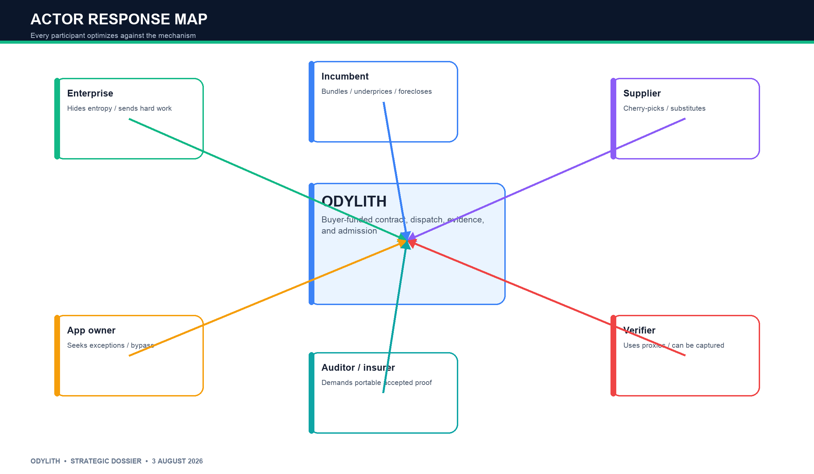

| Actor | Rational payoff | Likely behavior | Mechanism response |
|---|---|---|---|
| Enterprise principal | Value minus cost, delay, integration, and risk | Sends hard or low-status work outward; hides entropy | Route full predefined cohorts; freeze eligibility |
| Application owner | Delivery speed and local autonomy | Pressures for exceptions and bypass | Named owners, time-bound overrides, transparent false-denial cost |
| Internal agent/team | Status, budget, acceptance | Hides human rescue; optimizes visible tests | Track human minutes, attempts, hidden checks, immutable lineage |
| External supplier | Revenue minus inspection, execution, penalty, liability | Cherry-picks, substitutes cheaper models, inflates confidence | Binding identity/version, withdrawal rules, independent reliability |
| Verifier | Fee minus evaluation cost and liability | Uses cheap proxies; can be captured | Buyer chooses verifier; dependency/conflict graph; gold cases |
| Incumbent platform | Seat/cloud/workflow rent | Bundles, underprices, self-preferences, restricts telemetry | Customer-side deployment, external state, cross-system evidence |
| Auditor/insurer | Reliable evidence and bounded loss | Demands portability; distrusts proprietary lock-in | Open receipt, customer custody, named control mapping |
| Odylith | Subscription, mandatory order flow, institutional status | Tempted to exaggerate neutrality and liquidity | Buyer-funded revenue, disclosed conflicts, no supplier placement |

## Adverse selection

Buyers may send only ambiguous failures while keeping clean work inside. Suppliers may send aggressive bids for work they misunderstand. The mechanism must govern a complete predeclared cohort and use standardized task bands.

## Moral hazard

After selection, a supplier can substitute a model, reduce checking, use unapproved tools, consume hidden human labor, or optimize to visible tests. Scoped capabilities, version lineage, hidden evaluation, and human-effort accounting are mandatory.

## Winner's curse

The route most optimistic about legacy entropy wins. Standing offers by task band, paid inspection for expensive lots, withdrawal penalties, and re-execution obligations reduce the problem.

## Collusion and bypass

Thin repeated markets enable tacit collusion; successful matches encourage direct contracting. Use sealed offers, randomized invitation sets, buyer reserve prices, and a platform fee for persistent authorization/evidence rather than an introduction fee.

## Correlated supply

Three wrappers over one model or cloud are not resilience. Maintain a dependency graph across model, cloud, identity, toolchain, verifier, and data source. Apply concentration limits and common-mode stress tests.

---

# 18. Partial observability and causal inference

The most seductive false moat is an outcome graph that learns confidently wrong rankings.

For route A, the desired counterfactual is:

    expected total value if this exact job used A
    versus expected total value if the same job used B

Observed data are conditioned on chosen route, admitted result, customer, and time. They are confounded by:

- latent task difficulty;
- repository/process maturity;
- specification quality;
- context completeness;
- tool and permission differences;
- model and agent version;
- compute/reasoning budget;
- verifier strength;
- human repair and escalation;
- admission selection;
- calendar time and drift;
- delayed incidents and rollback.

Only accepted work reaches production. Difficult work is deliberately assigned to stronger routes. Human repair is post-treatment cost. Losing offers never create observed live outcomes. Providers silently change versions.

## Required evidence discipline

1. Pre-register the eligible cohort before outcomes.
2. Preserve the denominator: started, refused, abandoned, failed, retried, denied, overridden, admitted, deployed, rolled back.
3. Record assignment propensity and route eligibility.
4. Use paired frozen-state replays when safe.
5. Randomize only low-risk work or rollout order.
6. Keep context, tools, permissions, policy, and budget fixed in comparisons.
7. Count all human minutes and edits as route cost.
8. Track delayed state: deployment, health window, rollback, incident, owner acceptance.
9. Use external evidence, not hidden reasoning or provider narratives.
10. Bound every claim to the actual task class and cohort.

The route objective is:

    business utility
    − execution cost
    − verification cost
    − human repair
    − delay
    − expected rollback/incident loss
    − data and permission risk

Test pass, merge rate, benchmark score, and token price are incomplete proxies.

---

# 19. Incumbent control map and response

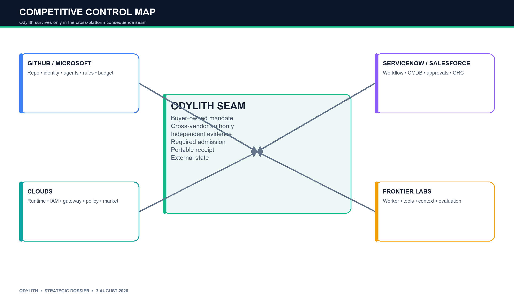

## What incumbents own now

- **GitHub/Microsoft:** developer system of record, repository identity, multi-agent access, rulesets, audit, budgets, security, approvals, Agent 365 [S1-S3, S6].
- **AWS/Google/Azure:** runtime, gateway, IAM, policy, routing, evaluations, observability, marketplace, cross-provider support [S5, S7-S9, S14-S16].
- **ServiceNow/Salesforce/IBM:** workflow context, CMDB, enterprise registry, governance, business process, approvals [S10-S12].
- **OpenAI/Anthropic/frontier labs:** worker intelligence, agent runtime, tools, long-running execution, enterprise controls [S21, S59-S62].
- **Gateways/observability:** multi-model APIs, budgets, fallback, privacy, guardrails, tracing [S13-S16, S63-S65].
- **Modernization/AppSec:** transformation, code review, SAST/SCA, migration campaigns, agent security [S22-S24, S30-S34, S66-S68].

## Expected response timeline after traction

| Window | Likely response | Odylith exposure |
|---|---|---|
| 0-3 months | Bundle dashboards/templates; waive fees; call Odylith duplicative | FinOps, generic governance, post-hoc check |
| 3-9 months | Add contract metadata, receipt objects, evaluator workflows | Receipt syntax and code-only evidence |
| 6-18 months | Support external agents while retaining identity/billing; use field sales and GSIs | Broad private facility |
| 9-24 months | Add deployment/incident linkage; offer selective warranties; acquire assurance vendors | Independent evidence survivor |
| 18-36 months | Push receipt/identity extensions into standards; centralize procurement | Proprietary protocol and marketplace |
| Any time | Restrict telemetry, change economics, prefer first-party runtime | Any provider-dependent routing moat |

## Counter-positioning

Odylith cannot outrun incumbents on feature count. It must:

- deploy on the customer's side of the trust boundary;
- rely on signed actions and authoritative state, not privileged provider reasoning;
- judge multiple workers against buyer-owned policy;
- cross at least two incumbent control domains;
- remain useful when customers contract directly with suppliers;
- export receipts and policy;
- make separation valuable through audit, risk, or contractual acceptance.

If evidence begins and ends inside one platform, that platform will win.

---

# 20. Defensibility and death conditions

The moat is not a feature. It is mandatory institutional placement plus an accumulated history that stays valuable as models change.

| Proposed moat | What could compound | Death condition |
|---|---|---|
| Required consequence boundary | Gate becomes part of release/change procedure | Customers remain shadow-only or bypass it |
| Execution-contract corpus | Reusable semantics and risk profiles | Every customer/repository is bespoke |
| Evidence graph | Signed mandate, action, exception, failure, delayed state | Only prompt/response traces or merge status are available |
| Buyer neutrality | One policy across internal and external workers | Convenience and bundling beat independence |
| Delegated authority | Customer retains required gate after friction/outage | Enterprise refuses any mandatory placement |
| Route performance | Task-conditional causal uplift | Ranking disappears after controls or model changes |
| Audit/insurer standing | Receipts satisfy named external processes | Receipts remain operational logs only |
| Integrations | Cross-system policy/evidence workflow | MCP/A2A and native tools commoditize connectors |
| Supplier network | Buyer demand forces eligibility | Strong suppliers go direct; buyer flow is thin |
| Standard influence | Contract/receipt behavior becomes expected | Open schema makes implementations interchangeable |

## The mandatory placement rule

> If Odylith cannot own a required decision at work ingress or admission and cannot observe the authoritative resulting state, it should not exist as a platform company.

## The perfect-model test

Ask: if the best available model could formulate, route, execute, and verify perfectly tomorrow, what would the customer still pay Odylith for?

Potentially durable answers:

- accountable principal and mandate;
- credential and resource constraints;
- separation of actor, verifier, and authorizer;
- independent attribution and evidence custody;
- transaction finality and external accountability;
- buyer-side policy across providers.

Everything else is on a declining clock.

---

# 21. Market size: bottom-up, not theater

There is no defensible public dataset for “independent execution-contract admission for enterprise agents.” A top-down TAM would be invented precision. The appropriate investment model begins with account counts, ACV, expansion, and market-formation gates.

## Observed sanity anchors

- Microsoft reported nearly 140,000 organizations using GitHub Copilot [S1]. Most are not the target account.
- GitLab reported more than 1,400 customers above $100,000 ARR and more than 150 above $1 million ARR for its enterprise platform [S69]. This demonstrates that thousands of organizations can support strategic SDLC-platform ACVs; it does not establish demand for Odylith.
- Agent, modernization, AppSec, and workflow vendors already price enterprise software through seats, usage, repositories, applications, and platform tiers [S25-S34, S66-S70].

## Initial obtainable market model

Planning filters:

1. 500+ developers.
2. 100+ JVM services or equivalent repeated change estate.
3. Active funded modernization campaign.
4. Multiple executor families.
5. GitHub/GitLab Enterprise and reliable evidence.
6. Regulated or operationally risk-sensitive.
7. Willingness to make a third-party decision required.

The count of accounts satisfying all seven is unknown and must be discovered. Model the company without pretending otherwise.

| Scenario | Addressable qualified accounts | Customer penetration | Customers | Average ACV | ARR |
|---|---:|---:|---:|---:|---:|
| Bear | 500 | 2% | 10 | $150K | $1.5M |
| Initial category | 1,500 | 5% | 75 | $225K | $16.9M |
| Strong wedge | 3,000 | 8% | 240 | $350K | $84M |
| Cross-domain platform | 5,000 | 10% | 500 | $600K | $300M |

Every number in this table is a planning assumption. The cross-domain case requires the same contract/receipt primitives to transfer beyond modernization and code. It is not the current market.

## Sensitivity

The venture case is most sensitive to:

- the percentage of enterprises retaining multiple consequential execution routes;
- the percentage that values technical separation enough to pay a new vendor;
- shadow-to-required conversion;
- pilot-to-annual conversion;
- contract reuse across repositories and customers;
- expansion into a second change class;
- ACV after native-platform discounting;
- customer-paid compute and gross margin;
- sales cycle and TPRM burden;
- whether receipts earn audit/risk standing.

If the initial wedge cannot sustain $150,000+ recurring ACV without services, the broad venture story should not be used to rescue it.

## Investor appetite and financing posture

**Observed fact:** strategic and venture capital continues to fund the infrastructure and security consequences of agent adoption. Palo Alto Networks completed its acquisition of Portkey in May 2026, explicitly integrating an AI gateway into its security platform [S71]. Willow announced a $7 million seed for agent governance; OpenBox announced a $5 million seed around governed agent infrastructure; ContextControl announced a $2.5 million seed around enterprise context control [S72-S74]. Secondary reporting also described a $58 million WitnessAI financing for enterprise AI security [S75]. These transactions show appetite for control and security. They do not prove Odylith's category or valuation.

**Investor inference:** a generic “AI control plane” will be hard to finance on narrative alone because hyperscalers, GitHub, ServiceNow, Salesforce, and security platforms already occupy it. A narrow required-admission wedge is easier to underwrite because the buyer, enforcement point, price, conversion, and abandonment rule are legible.

The fundable story should separate two layers:

- **Capital release case:** paid modernization admission with six-figure conversion and software margins.
- **Venture upside:** move from admission into qualified assignment, then private supply, without requiring a public exchange.

The highest plausible revenue sits in multi-domain authority and routing at $500,000-$1 million ACV, but the company earns the right to present that case only after the initial receipt becomes mandatory. Financing should therefore be milestone-tranched rather than sized against an imagined exchange TAM.

---

# 22. Three-to-five-year scenarios

These are strategic operating cases, not forecasts.

## Bear: required control never forms

- Two or three pilots buy reports.
- No customer permits persistent blocking.
- Native GitHub/cloud/modernization tools satisfy most residual evidence needs.
- Each implementation requires custom policy and test work.
- Annual conversions fail.

**Result:** stop at month three to six. Return remaining capital. Possible open-source contract work or consulting is outside the venture thesis.

## Base: regulated assurance niche

- Two of three early pilots enforce and convert.
- Standard contract packs cover JVM modernization and dependency/security campaigns.
- Company reaches 50-100 regulated customers at $200,000-$350,000 ACV.
- Receipts integrate with audit and change workflows.
- Routing remains customer-local and limited to qualified routes.

**Result:** $15M-$30M ARR, attractive software business; platform upside remains unproven.

## Bull: buyer-side execution router

- Mandatory admission expands from code to IaC, database, data pipeline, and enterprise workflows.
- Customers submit work contracts before execution and permit active dispatch.
- Internal agents, frontier agents, SIs, and specialist providers compete under comparable evidence and authority conditions.
- Odylith controls qualified order flow without supplier-funded ranking.
- Some suppliers provide binding capacity and service terms.

**Result:** 200-500 customers at $350,000-$1M ACV; $100M-$300M ARR possible under the planning model.

## Extreme bull: institution for autonomous work

- Auditors, insurers, or counterparties rely on portable receipts.
- A private verifier and risk ecosystem forms.
- The execution contract becomes a behavior standard.
- Payment rails trigger on accepted receipts, but Odylith still does not need to become a central counterparty.

**Result:** infrastructure-scale control point. This is optionality, not an underwriting premise.

---

# 23. Risk register and heat map

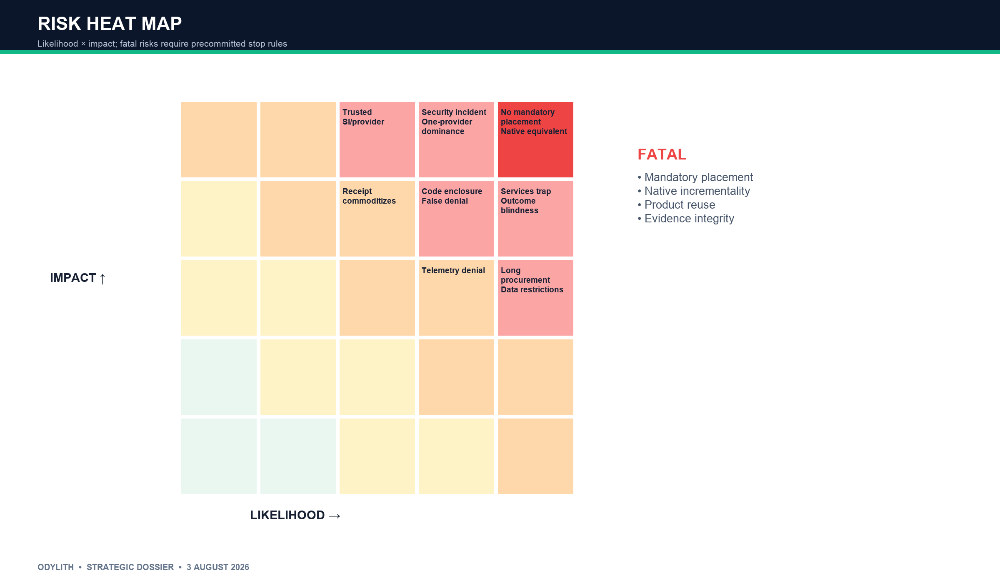

| Risk | Likelihood | Impact | Early indicator | Response |
|---|---|---|---|---|
| Enterprise refuses mandatory placement | High | Fatal | Shadow praise, no required status | Precommit enforcement before pilot |
| Native GitHub/cloud equivalent | High | Fatal | Competitive loss to bundled control | Cross-system evidence; kill if no residual |
| Services trap | High | High | Custom policies/tests >20% first-year value | Hard product boundary; partners execute |
| Code-only enclosure | Medium-high | High | No second domain/request | Require cross-system downstream state |
| False denial / delivery friction | Medium | High | Overrides and bypass rise | Deterministic hard laws; shadow/canary; fail-safe |
| Outcome blindness | High | High | Only merge/test labels | Downstream health, rollback, incident linkage |
| Causal ranking error | High | High | Rankings flip with task mix | Pre-registration, propensity, replays, uncertainty |
| Provider telemetry denial | Medium-high | Medium | Missing prompts/traces | Design around external state, not reasoning |
| Customer data restrictions | High | Medium | No pooled learning | Tenant-local models; portable templates only |
| One provider dominates supply | Medium | Fatal to market | Route wins >80% | Operate assurance business; abandon market claim |
| Regulation does not require independence | High | Medium | Internal controls accepted | Sell operational value; no regulatory hand-wave |
| Receipt commoditizes as standard | High | Medium | OPA/in-toto/native receipt adoption | Own lifecycle, evidence correlation, enforcement |
| Security incident at Odylith | Medium | Fatal | Integrity or authorization breach | Least privilege, local keys, fail-safe, audits |
| Long procurement cycle | High | Medium | >90 days to pilot | Narrow data posture, buyer urgency, paid design |
| Superintelligence/provider trust | Low near-term | Fatal long-term | Provider warrants and self-authorizes | Institutional separation or no company |

---

# 24. Hidden confounders and premortem

## Ten hidden confounders

1. **Innovation sponsor is not the authority owner.** Pilot excitement can coexist with platform/security refusal.
2. **The native baseline is weak.** Odylith can appear valuable by comparing itself with poorly configured existing controls.
3. **Observation is not delegation.** Shadow volume and dashboard usage do not prove mandatory placement.
4. **Task selection flatters the product.** Easy or well-tested tasks enter while difficult work stays elsewhere.
5. **Executor identity hides treatment differences.** Context, tools, permissions, compute, and human support cause apparent route quality.
6. **Human rescue disappears from metrics.** Merge and success rates ignore review, retry, editing, and escalation.
7. **Immediate evidence is a poor outcome proxy.** Tests pass while delayed rollback or operational harm appears later.
8. **Policy depth is consulting.** High ACV reflects manual semantic reconstruction, not a product.
9. **Multiple brands are correlated supply.** Routes share model, cloud, identity, tools, and verifiers.
10. **Code success does not generalize.** The universal contract collapses outside software into domain-specific semantics.

## Premortem timeline

**Months 0-6:** attractive shadow pilots reveal many immature native controls. Bespoke policy mapping is called platform learning.

**Months 6-12:** service owners refuse blocking; security approves observation; implementation revenue grows but recurring authority stalls.

**Months 12-18:** GitHub and cloud platforms add richer task contracts and receipt objects. Cross-platform neutrality remains a talking point without budget.

**Months 18-24:** performance rankings fail to generalize because task mix, human repair, and model drift dominate.

**Months 24-36:** non-code expansion requires new buyers, semantics, liability, and integrations. The “universal” contract becomes shallow consulting glue.

**Terminal outcome:** GitHub-adjacent security tool, services-heavy policy integrator, acquisition target, or dashboard.

The 90-day gates are designed to detect this trajectory before the company finances it.

---

# 25. Assumption dependency graph

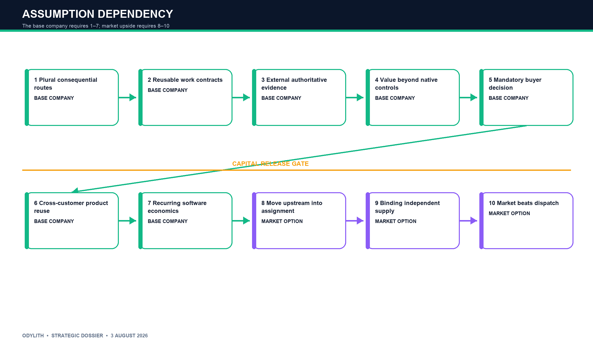

The investment case depends on a chain. Each upstream failure invalidates downstream upside.

1. Multiple consequential routes persist.
2. The buyer can describe repeated work through reusable contracts.
3. Authoritative evidence is available without privileged reasoning.
4. Independent evaluation adds value beyond configured native controls.
5. The buyer delegates a mandatory decision.
6. Contracts and integrations reuse across customers.
7. Required placement produces recurring six-figure revenue at software margins.
8. Admission moves upstream into assignment.
9. Several independent routes offer binding capacity.
10. Private market mechanisms outperform simple dispatch.

Only assumptions 1-7 are required for the base company. Assumptions 8-10 create the market upside. The company must not price itself today as if all ten were facts.

---

# 26. Paid falsification scorecard

## Demand and budget

- Fifteen qualified accounts approached.
- At least three $75,000 paid pilots; two is the minimum to continue the experiment.
- Budget comes from modernization/platform/change control, not innovation theater.
- Annual option prepriced in the pilot order.

## Contractability and product reuse

- At least 70% of the repository cohort fits common contract and risk profiles.
- At least 70% of contract/evidence primitives transfer to the second customer without custom code.
- Second deployment takes fewer than ten engineering days.
- Customer-specific manual work stays below 20% of first-year value.

## Incremental evidence value

- Baseline includes properly configured GitHub, CI, security, and modernization tooling.
- At least three independently adjudicated material residual issue classes.
- At least 10% of candidate changes show confirmed material contract/evidence gaps not surfaced by the assembled native stack; this threshold is a planning hypothesis.
- Findings are operationally meaningful, not documentation cosmetics.

## Decision quality and friction

- Zero known false ALLOW on frozen deterministic hard-law violations.
- False DENY below 0.5% for deterministic rules.
- Escalation below 25%; warning threshold 35%.
- Bypass below 5%; all overrides attributable.
- P95 Odylith overhead below five minutes excluding existing CI.
- No material increase in accepted-change cycle time.

## Authority and institutional standing

- At least two unrelated customers use a required status on a real production-impacting class.
- Coverage includes at least 70% of the eligible cohort; 80% is the stronger proof target.
- One receipt is accepted in writing against a named security, audit, risk, or change process.
- Enforcement survives an outage and false-denial drill.

## Economics

- At least two pilots convert to $150,000+ ARR; target three of five over the first cohort.
- Direct gross-margin path above 75%; mature target above 80%.
- Model and executor spend stays on customer accounts.
- No code remediation, custom transformation recipes, or managed delivery by Odylith.

## Routing and market gates

Do not build active routing until:

- at least two genuinely independent routes exist for a class;
- customers accept shadow route recommendations at least 70% of the time;
- controlled evidence shows route choice varies by context;
- one route does not dominate more than roughly 80%;
- total routing uplift exceeds verification, experimentation, delay, and human cost.

Do not open private supply until three routes offer binding price, capacity, identity, evidence, data, and recovery terms.

---

# 27. Final decision tree

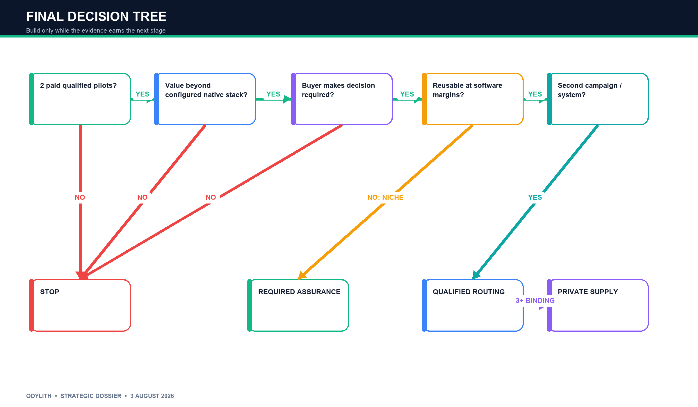

## Decision logic

**Do two qualified buyers pay?**

- No → no build.
- Yes → test contract and native baseline.

**Does Odylith add material value beyond configured native controls?**

- No → feature/consulting; stop.
- Yes → run shadow and bounded enforcement.

**Will buyers make the decision required?**

- No → dashboard; stop.
- Yes → test false denial, bypass, latency, and fail-safe.

**Does the contract reuse at software margins?**

- No → services business; stop or partner.
- Yes → convert to production assurance.

**Does the same machinery govern a second campaign or cross-system class?**

- No → profitable niche or acquisition outcome; do not claim broad platform.
- Yes → move upstream into qualified assignment.

**Do multiple binding independent routes exist?**

- No → remain private assurance router.
- Yes → create standing-offer facility.

**Do dynamic bids improve allocation?**

- No → retain standing dispatch.
- Yes → introduce private sealed auctions.

At no point is a public marketplace or clearinghouse required for the base business.

---

# 28. What Odylith should force into existence

The contract format is not the moat; the behavior it makes normal may be.

## Autonomous-work rules

1. No consequential action without an identified principal.
2. No action without a purpose-bound, time-bound capability envelope.
3. No provider may be its own sole verifier for a high-risk class.
4. “Completed” is distinct from “accepted.”
5. Human correction is an explicit cost, not invisible rescue.
6. Model, tool, policy, and evidence versions are immutable treatment identifiers.
7. Uncertainty escalates; it does not fabricate confidence.
8. Every override has an owner, scope, reason, and expiry.
9. Every loss, rollback, or dispute links to the original mandate and receipt.
10. Routing conflicts, rebates, and paid placement are disclosed; Odylith accepts none.

## Adoption leverage

1. Publish a portable local SDK for contracts and receipts.
2. Sell a paid shadow deployment against a real campaign.
3. Precommit the customer to a graduation class.
4. Become required in two systems: repository/task plus downstream deployment, cloud, database, identity, or change system.
5. Put contract compatibility into procurement requirements for agent suppliers.
6. Earn auditor, insurer, or counterparty recognition.
7. Allow suppliers only after buyer demand is mandatory.
8. Add private allocation and market mechanisms conditionally.

The leverage point is an enterprise rule:

> No agent receives consequential work unless it can operate under this contract and produce this evidence.

---

# 29. Final pitch

## Why

> Enterprises are about to run thousands of agents—built internally and bought from many vendors—but the agents that perform work cannot be allowed to define their own mandate, grant their own authority, or certify their own result.

## What

> Odylith binds every consequential agent task to an accountable execution contract, routes it through approved workers and proof, and issues the signed decision that lets the enterprise accept, deny, or escalate the change.

## Starting product

> We start with software-modernization campaigns, where the work is funded, repeated, and verifiable: any agent or vendor can produce the change, but Odylith provides one customer-owned definition of what is authorized and what evidence makes it admissible.

## Investor version

> Odylith is the buyer-side assurance router for autonomous work. It lands as a required execution contract and evidence gate for software modernization, expands into cross-agent assignment, and creates a private execution market only after it controls qualified demand. Intelligence may become free; legitimate authority, evidence, and accountability do not automatically become free.

## The concise company thesis

> AI makes execution abundant. Odylith controls which execution is allowed to become real.

---

# 30. Investment recommendation

## Vote

**Authorize a capped 90-day commercialization tranche. Do not yet finance the full platform or market thesis.**

The independent adjudicator reached the same conclusion: waiting dominates building a FinOps router or broad facility, but it does not dominate a capped paid modernization-admission probe. The probe uses present work, a present budget, an existing enforcement point, and legible kill conditions.

## Capital posture

Fund the smallest team capable of the paid experiment: founder-led enterprise sale, product/security engineering, one integration/evidence specialist, and a security/product lead. Release further capital only on paid pilots, required placement, reusable deployment, annual conversion, and institutional receipt use.

## Conditions precedent

- No paid pilot, no build.
- No required decision, no platform claim.
- No native-baseline incrementality, no category.
- No contract reuse, no software-margin thesis.
- No annual conversion, no continuation.
- No second campaign or cross-system reuse, no horizontal expansion.
- No independent binding supply, no marketplace language.

## Final adjudication

The company should exist only in the narrower form:

> A customer-controlled execution-contract and assurance router that begins with a required modernization admission decision and earns the right to allocate autonomous work.

The original broad router-to-clearinghouse vision is not the investment case. It is a contingent sequence of options. The base business must make money at required admission even if routing remains private, auctions never form, and clearing never becomes rational.

---

# 31. Adversarial review record

## First-wave findings

| Review | Initial position | Strongest contribution |
|---|---|---|
| Enterprise revenue | Start with cross-vendor agent FinOps/policy/shadow routing | Proved present usage billing and paid budget; exposed GitHub enclosure |
| Market/game theory | Start with a private execution facility; no public market | Defined demand, supply, inventory, bids, liquidity, and formation gates |
| Technology/scarcity | Durable layer is authority/evidence, not cognition | Modeled zero-cost and superintelligence value migration |
| Incumbent alternatives | Independent change assurance is strongest survivor | Mapped feature envelopment and cross-platform consequence boundary |
| Buyer/CISO | Narrow Java/Spring modernization evidence gate | Identified buyer, safe authority, deployment, procurement, and paid test |
| Existential falsifier | Default no company | Established mandatory placement, causal truth, and institutional standing as survival tests |

## Second-wave cross-examination

- The commercial reviewer reversed its own FinOps recommendation and selected modernization admission because FinOps observes after the critical decision and does not ease the transition to authority.
- The buyer reviewer killed a post-hoc Java status-check product and required a pre-execution contract runtime plus post-execution receipt; Java remains the use case, not the identity.
- The mechanism reviewer concluded that admission is the only wedge that creates qualified order flow without assuming a market.
- The constructive bull voted invest, conditional on a required Assurance Router and milestone releases.
- The final bear voted no-go until production mandatory placement, cross-system evidence, native-baseline superiority, reuse, and six-figure annual contracts exist.
- The independent adjudicator authorized only a capped 90-day commercialization tranche and prohibited an automatic pivot to FinOps or broad governance if it fails.

## Adjudicated resolution

The bear is correct about present uncertainty; the bull is correct that the uncertainty can be resolved quickly and commercially. “Conditional build” is therefore not a rhetorical compromise. It is a real option with an explicit strike price, expiry, and abandonment rule.

---

# 32. Evidence and assumption ledger

| Claim | Type | Confidence | Evidence / test |
|---|---|---:|---|
| Multi-model enterprise use is present | Fact | High | Microsoft/GitHub [S1-S3] |
| Raw routing and governance are bundled | Fact | High | GitHub/cloud/workflow vendors [S3, S5-S16] |
| Inference price-performance continues improving | Inference from fact | High | Stanford/provider pricing [S42-S44] |
| Total AI execution grows despite lower unit cost | Inference | Medium-high | Adoption, token growth, infrastructure [S1, S42-S47] |
| Modernization is a funded repeated work category | Fact/inference | High | AWS/Microsoft/Moderne/roadmaps [S22-S24, S30-S34] |
| Independent admission has separate willingness to pay | Assumption | Low | Two paid pilots and annual conversion |
| Enterprises will delegate deterministic required status | Assumption | Low-medium | Bounded enforcement at two customers |
| Contract core generalizes | Assumption | Low | Reuse across customers/executors |
| Receipts gain risk/audit standing | Assumption | Low | Written named-control acceptance |
| Routing creates persistent causal uplift | Assumption | Low | Controlled assignments and delayed outcomes |
| Multiple independent suppliers persist | Assumption | Medium | Route-dependency and volume data |
| Private standing supply can form | Product-will | Low | Three binding offers and committed demand |
| Reverse auctions improve allocation | Product-will | Very low | Repeated private clearing better than standing dispatch |
| Superintelligence preserves separation of powers | Institutional hypothesis | Low | Customer policies and future law/insurance behavior |

---

# 33. Source ledger and bibliography

Sources were prioritized in this order: company filings and earnings calls; official product and technical documentation; standards bodies, regulators, and government research; peer-reviewed or working research; vendor surveys only when clearly labeled. Sources establish market facts, not Odylith product-market fit.

**[S1]** Microsoft, “FY 2026 Q3 Earnings,” April 2026. https://www.microsoft.com/en-us/investor/events/fy-2026/earnings-fy-2026-q3

**[S2]** GitHub, “Claude and Codex now available for Copilot Business/Pro users,” 26 February 2026. https://github.blog/changelog/2026-02-26-claude-and-codex-now-available-for-copilot-business-pro-users/

**[S3]** GitHub, “Enterprise AI controls: agent control plane generally available,” 26 February 2026. https://github.blog/changelog/2026-02-26-enterprise-ai-controls-agent-control-plane-now-generally-available/

**[S4]** Salesforce, “Fourth Quarter and Fiscal 2026 Results,” 2026. https://investor.salesforce.com/news/news-details/2026/Salesforce-Delivers-Record-Fourth-Quarter-Fiscal-2026-Results/default.aspx

**[S5]** AWS, “Policy in Amazon Bedrock AgentCore generally available,” 3 March 2026. https://aws.amazon.com/about-aws/whats-new/2026/03/policy-amazon-bedrock-agentcore-generally-available/

**[S6]** Microsoft Learn, “Microsoft Agent 365 overview,” updated 4 June 2026. https://learn.microsoft.com/en-us/microsoft-agent-365/overview

**[S7]** Google Cloud, “Gemini Enterprise Agent Platform,” 22 April 2026. https://cloud.google.com/blog/products/ai-machine-learning/introducing-gemini-enterprise-agent-platform

**[S8]** Google Cloud, “Introducing Agent Gateway ecosystem,” 5 May 2026. https://cloud.google.com/blog/products/identity-security/introducing-agent-gateway-isv-ecosystem-for-security-and-governance

**[S9]** Microsoft Learn, “Foundry model router,” accessed 3 August 2026. https://learn.microsoft.com/en-us/azure/foundry/openai/concepts/model-router

**[S10]** IBM, “Introducing the agentic control plane,” June 2026. https://www.ibm.com/new/announcements/introducing-the-agentic-control-plane

**[S11]** ServiceNow, “AI Control Tower expansion,” 5 May 2026. https://newsroom.servicenow.com/press-releases/details/2026/ServiceNow-expands-AI-Control-Tower-to-discover-observe-govern-secure-and-measure-AI-deployed-across-any-system-in-the-enterprise/default.aspx

**[S12]** Salesforce, “MuleSoft Agent Fabric,” 25 September 2025. https://www.salesforce.com/news/stories/mulesoft-agent-fabric-announcement/

**[S13]** Cloudflare, “AI Gateway Dynamic Routing,” updated 5 June 2026. https://developers.cloudflare.com/ai-gateway/features/dynamic-routing/

**[S14]** OpenRouter, “Pricing,” accessed 3 August 2026. https://openrouter.ai/pricing

**[S15]** Portkey, “AI Gateway,” accessed 3 August 2026. https://portkey.ai/docs/product/ai-gateway

**[S16]** AWS, “Bedrock Intelligent Prompt Routing,” accessed 3 August 2026. https://docs.aws.amazon.com/bedrock/latest/userguide/prompt-routing.html

**[S17]** Stripe, “Machine Payments Protocol,” 18 March 2026. https://stripe.com/blog/machine-payments-protocol

**[S18]** Mastercard, “Agent Pay for Machines,” 10 June 2026. https://www.mastercard.com/us/en/news-and-trends/press/2026/june/mastercard-launches-agent-pay-for-machines.html

**[S19]** Visa, “Trusted Agent Protocol,” 14 October 2025. https://usa.visa.com/about-visa/newsroom/press-releases.releaseId.21716.html

**[S20]** Bank for International Settlements, “Principles for Financial Market Infrastructures summary.” https://www.bis.org/fsi/fsisummaries/pfmi.htm

**[S21]** OpenAI, “Introducing OpenAI Frontier,” 5 February 2026. https://openai.com/index/introducing-openai-frontier/

**[S22]** GitHub, “Copilot app modernization GA for Java and .NET,” 22 September 2025. https://github.blog/changelog/2025-09-22-github-copilot-app-modernization-is-now-generally-available-for-java-and-net/

**[S23]** AWS, “Transform continuous modernization,” 15 June 2026. https://aws.amazon.com/about-aws/whats-new/2026/06/aws-transform-continuous-modernization/

**[S24]** Moderne, “Moderne Platform,” accessed 3 August 2026. https://moderne.ai/platform

**[S25]** GitHub Docs, “Copilot billing for organizations and enterprises,” accessed 3 August 2026. https://docs.github.com/en/copilot/concepts/billing/organizations-and-enterprises

**[S26]** GitHub Docs, “Budget controls,” accessed 3 August 2026. https://docs.github.com/en/enterprise-cloud%40latest/copilot/tutorials/budgets/getting-started-with-budget-controls

**[S27]** Cursor, “Teams pricing, June 2026.” https://cursor.com/blog/teams-pricing-june-2026

**[S28]** GitLab, “GitLab credits,” accessed 3 August 2026. https://docs.gitlab.com/subscriptions/gitlab_credits/

**[S29]** Glean, “Enterprise Agent Development Lifecycle,” 2026. https://www.glean.com/press/glean-introduces-the-enterprise-agent-development-lifecycle-codifying-how-enterprises-build-govern-and-measure-ai-agents

**[S30]** Amazon Q Developer, “Pricing.” https://aws.amazon.com/q/developer/pricing/

**[S31]** AWS, “How Amazon Q code transformation works.” https://docs.aws.amazon.com/amazonq/latest/qdeveloper-ug/how-CT-works.html

**[S32]** Oracle, “Java SE support roadmap,” accessed 3 August 2026. https://www.oracle.com/in/java/technologies/java-se-support-roadmap.html

**[S33]** Microsoft, “.NET and .NET Core support policy,” accessed 3 August 2026. https://dotnet.microsoft.com/en-us/platform/support/policy

**[S34]** Red Hat, “Migration Toolkit for Applications 8.2,” 21 July 2026. https://developers.redhat.com/products/mta/download

**[S35]** GitHub Docs, “Rules available for rulesets,” accessed 3 August 2026. https://docs.github.com/en/enterprise-cloud%40latest/repositories/configuring-branches-and-merges-in-your-repository/managing-rulesets/available-rules-for-rulesets

**[S36]** GitHub Docs, “Copilot coding agent risks and mitigations,” accessed 3 August 2026. https://docs.github.com/en/enterprise-cloud%40latest/copilot/concepts/agents/cloud-agent/risks-and-mitigations

**[S37]** GitHub Docs, “Copilot code review,” accessed 3 August 2026. https://docs.github.com/en/copilot/how-tos/use-copilot-agents/request-a-code-review/use-code-review

**[S38]** NIST, “AI Agent Standards Initiative,” updated 20 April 2026. https://www.nist.gov/artificial-intelligence/ai-agent-standards-initiative

**[S39]** NIST, “Identity and Authority of Software Agents,” February 2026. https://www.nist.gov/news-events/news/2026/02/new-concept-paper-identity-and-authority-software-agents

**[S40]** NIST, “Challenges in Monitoring Deployed AI Systems,” 6 March 2026. https://www.nist.gov/publications/challenges-monitoring-deployed-ai-systems-center-ai-standards-and-innovation

**[S41]** NIST, “Cheating in AI Agent Evaluations,” updated 2 December 2025. https://www.nist.gov/caisi/cheating-ai-agent-evaluations

**[S42]** Stanford HAI, “2026 AI Index Report,” 13 April 2026. https://hai.stanford.edu/ai-index/2026-ai-index-report

**[S43]** Stanford HAI, “AI Index 2025: state of AI in 10 charts,” 7 April 2025. https://hai.stanford.edu/news/ai-index-2025-state-of-ai-in-10-charts

**[S44]** Epoch AI, “LLM inference price trends,” accessed 3 August 2026. https://epoch.ai/data-insights/llm-inference-price-trends

**[S45]** International Energy Agency, “Energy and AI,” 10 April 2025. https://www.iea.org/reports/energy-and-ai/

**[S46]** International Energy Agency, “Key questions on energy and AI,” 2026. https://www.iea.org/reports/key-questions-on-energy-and-ai/executive-summary

**[S47]** Microsoft, “FY2026 Q3 Earnings,” AI infrastructure comments, April 2026. https://www.microsoft.com/en-us/investor/events/fy-2026/earnings-fy-2026-q3

**[S48]** Linux Foundation, “A2A protocol surpasses 150 organizations,” 9 April 2026. https://www.linuxfoundation.org/press/a2a-protocol-surpasses-150-organizations-lands-in-major-cloud-platforms-and-sees-enterprise-production-use-in-first-year

**[S49]** Anthropic, “Donating MCP and establishing the Agentic AI Foundation,” 9 December 2025. https://www.anthropic.com/news/donating-the-model-context-protocol-and-establishing-of-the-agentic-ai-foundation

**[S50]** Visa, “Agentic commerce and machine payments,” accessed 3 August 2026. https://corporate.visa.com/en/sites/visa-perspectives/innovation/visa-card-specification-sdk-for-machine-payments-protocol.html

**[S51]** European Commission, “EU AI Act regulatory framework,” updated 27 July 2026. https://digital-strategy.ec.europa.eu/en/policies/regulatory-framework-ai

**[S52]** EU, Commission Delegated Regulation 2024/1774, Article 17. https://eur-lex.europa.eu/legal-content/EN/ALL/?uri=CELEX%3A02024R1774-20240625

**[S53]** Federal Reserve, “Supervisory Guidance on Model Risk Management,” 17 April 2026. https://www.federalreserve.gov/frrs/guidance/supervisory-guidance-on-model-risk-management.htm

**[S54]** NIST, SP 800-53 Rev. 5.1 controls, updated July 2026. https://csrc.nist.gov/Projects/risk-management/sp800-53-controls/downloads

**[S55]** Open Policy Agent, documentation, accessed 3 August 2026. https://www.openpolicyagent.org/docs

**[S56]** in-toto, “Getting started,” accessed 3 August 2026. https://in-toto.io/docs/getting-started/

**[S57]** SLSA, provenance specification. https://slsa.dev/spec/v0.1/provenance

**[S58]** OpenTelemetry, “Generative AI observability,” 14 May 2026. https://opentelemetry.io/blog/2026/genai-observability/

**[S59]** OpenAI, “New tools for building agents,” 11 March 2025. https://openai.com/index/new-tools-for-building-agents/

**[S60]** OpenAI, “Codex is now generally available,” 6 October 2025. https://openai.com/index/codex-now-generally-available/

**[S61]** Anthropic, “Claude Code and admin controls for business plans,” 20 August 2025. https://www.anthropic.com/news/claude-code-on-team-and-enterprise

**[S62]** Anthropic, “Enabling Claude Code to work more autonomously,” 29 September 2025. https://www.anthropic.com/news/enabling-claude-code-to-work-more-autonomously

**[S63]** LangSmith, “Evaluation,” accessed 3 August 2026. https://docs.langchain.com/langsmith/evaluation

**[S64]** LiteLLM, documentation, accessed 3 August 2026. https://docs.litellm.ai/

**[S65]** Cloudflare, “AI Gateway spend limits,” updated 18 June 2026. https://developers.cloudflare.com/ai-gateway/features/spend-limits/

**[S66]** Snyk, “Evo Agentic Development Security,” 23 June 2026. https://snyk.io/news/snyk-launches-evo-agentic-development-security/

**[S67]** GitHub, “Security campaigns,” accessed 3 August 2026. https://docs.github.com/en/code-security/concepts/security-at-scale/about-security-campaigns

**[S68]** DORA, “Streamlining change approval,” updated 30 October 2025. https://dora.dev/capabilities/streamlining-change-approval/

**[S69]** GitLab, FY2026 Form 10-K. https://www.sec.gov/Archives/edgar/data/1653482/000162828026018731/gtlb-20260131.htm

**[S70]** Semgrep, “Pricing,” accessed 3 August 2026. https://semgrep.dev/pricing/

**[S71]** Palo Alto Networks, “Completes acquisition of Portkey to secure AI,” 29 May 2026. https://paloaltonetworks.gcs-web.com/news-releases/news-release-details/palo-alto-networks-completes-acquisition-portkey-secure-ai

**[S72]** Willow, “$7M seed funding,” 2026. https://withwillow.ai/blog/willow-7m-seed-funding

**[S73]** OpenBox, “The governance infrastructure that agentic AI has been missing,” 2026. https://www.openbox.ai/blog/the-governance-infrastructure-that-agentic-ai-has-been-missing

**[S74]** ContextControl, “Enterprise context-control model launch,” 2026. https://www.nofire.ai/newsroom/context-control-model-launch

**[S75]** Axios, “WitnessAI funding for enterprise AI security,” 13 January 2026. https://www.axios.com/2026/01/13/witnessai-funding-enterprise-ai

---

# Appendix A. Safe interpretation of “independent”

“Independent” does not mean Odylith becomes a sovereign external approver. It means the adjudicating identity, policy custody, and evidence path are technically and organizationally separate from the worker being evaluated.

Minimum separation:

- separate service principal and credentials;
- customer-owned policy repository;
- validator cannot alter the change it adjudicates;
- generator, validator, and human approver are distinct identities;
- evidence and exception history are tamper-evident;
- blocking decisions are reproducible from named evidence;
- LLM opinion alone cannot produce a hard denial or a safety claim.

The customer remains legally and operationally accountable.

---

# Appendix B. Product boundary tests

Odylith is a platform only if:

- it owns contract lifecycle and admission;
- most evidence is gathered from existing authoritative systems;
- contracts reuse across repositories and customers;
- enforcement is local and reliable;
- receipts are independently verifiable;
- annual subscription persists beyond one campaign;
- routing can be added without changing the buyer and trust boundary.

Odylith is services if:

- it writes migration code or tests;
- it repairs CI and application failures;
- experts manually adjudicate ordinary cases;
- every repository requires a custom ontology;
- revenue ends with the campaign;
- implementation labor grows linearly with governed work.

Odylith is a dashboard if:

- it only observes;
- decisions are optional;
- the customer does not precommit graduation;
- evidence has no named consumer;
- reports are praised but annual controls are not purchased.

---

# Appendix C. Claims deliberately not made

This dossier does not claim:

- that Odylith has proven external product-market fit;
- that current internal benchmarks predict customer outcomes;
- that frontier models are incapable of verification;
- that regulation mandates an external control vendor;
- that a public market for agent labor currently exists;
- that supplier bids can credibly guarantee enterprise outcomes;
- that a clearinghouse is a natural or necessary destination;
- that projected prices or account counts are observed demand;
- that code admission automatically generalizes to other domains;
- that superintelligence necessarily strengthens Odylith.

The thesis is valuable because its falsifiers are visible, not because the future is guaranteed.

